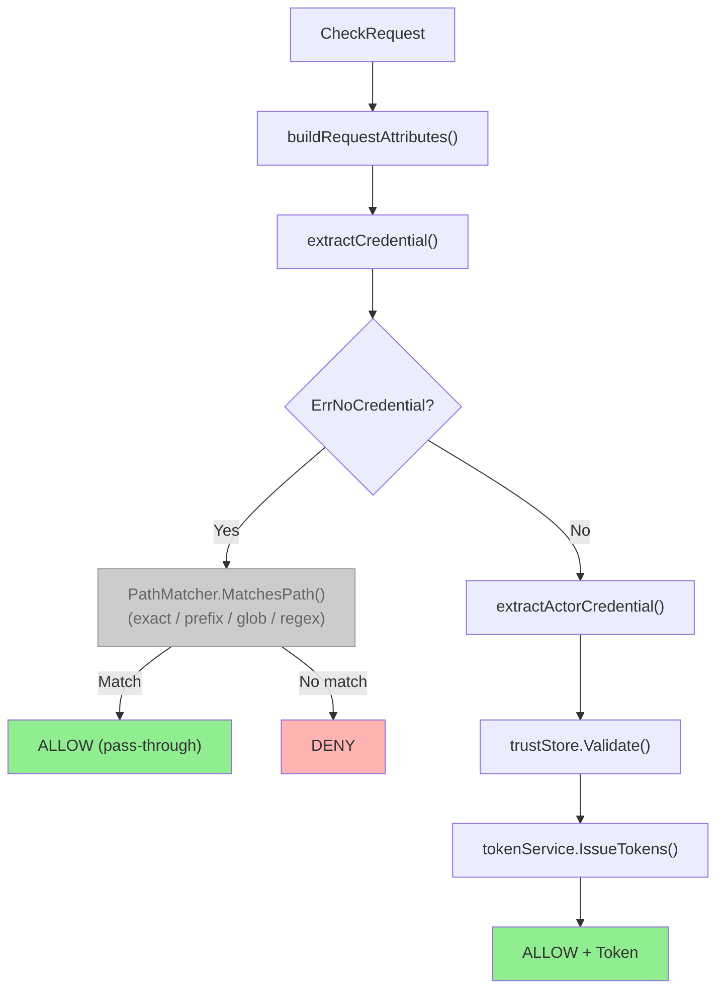
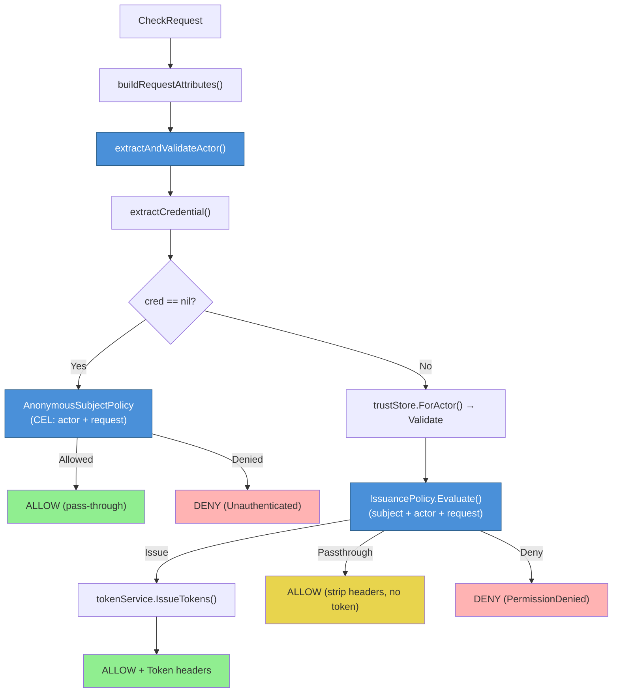
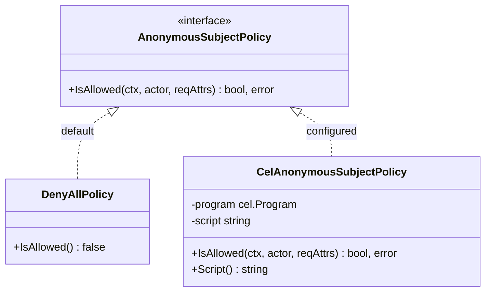

# Current Code Changes: Policy Engine Refactor

This document explains the in-progress refactoring of parsec's ext_authz authorization flow — replacing the `OptionalAuthPathMatcher` with a CEL-based **policy engine** that introduces two new policy layers: **AnonymousSubjectPolicy** and **IssuancePolicy**.

**Branch:** `RHCLOUD-47931-optional-path`

---

## Summary of Changes

| Metric | Count |
|---|---|
| Files modified | 17 |
| Files added | 6 |
| Files deleted | 5 |
| Lines added | ~1,109 |
| Lines removed | ~1,185 |

### What changed

The old `OptionalAuthPathMatcher` approach used a set of path-pattern rules (exact, prefix, glob, regex) to decide whether an unauthenticated request could pass through. This has been replaced by a two-layer CEL policy engine:

1. **AnonymousSubjectPolicy** — decides if requests *without credentials* are allowed
2. **IssuancePolicy** — decides if validated requests should *issue tokens*, *passthrough*, or be *denied*

---

## Before vs. After


### Before: `OptionalAuthPathMatcher`



**Problems with the old approach:**
- Path matching was purely structural (no access to actor identity or request context)
- No way to make issuance decisions *after* validation (e.g. passthrough for health checks that have valid credentials)
- Actor extraction happened *after* credential extraction — so the anonymous path had no actor context
- Four match types (exact, prefix, glob, regex) with overlapping semantics and edge cases

### After: Policy Engine



**Key structural change:** Actor extraction is moved *before* credential extraction, so the anonymous subject policy has access to the validated actor.

---

## New Components

### 1. AnonymousSubjectPolicy (`internal/server/anonymous_subject_policy.go`)

Decides whether a request **without subject credentials** should be allowed through.



**CEL variables available:**

| Variable | Type | Contents |
|---|---|---|
| `actor` | map | Validated actor result (`subject`, `issuer`, `trust_domain`, `claims`) |
| `request` | map | Request attributes (`method`, `path`, `headers`, `additional`) |

**Path security:** Before CEL evaluation, the request path is validated via `request.ParseMatchPath()`. Percent-encoding, dot-segment traversal (`../`), and double slashes (`//`) are rejected outright — the policy returns `false` without evaluating CEL.

**Example CEL expression:**

```cel
request.path.matches("^/api/[^/]+/v[0-9]+/openapi\\.json$") ||
request.path.startsWith("/api/docs/") ||
(request.method == "GET" && request.path == "/health") ||
(has(request.additional.context_extensions) &&
 request.additional.context_extensions.optional_auth == "true")
```

### 2. IssuancePolicy (`internal/server/issuance_policy.go`)

Evaluated **after** successful subject validation but **before** token issuance. Controls whether to issue tokens, passthrough, or deny.

```mermaid
classDiagram
    class IssuancePolicy {
        <<interface>>
        +Evaluate(ctx, subject, actor, reqAttrs) *IssuanceDecision, error
    }

    class IssuanceDecision {
        +TokenTypes []TokenType
        +Scope string
    }

    class AlwaysIssuePolicy {
        -tokenTypes []TokenType
        +Evaluate() *IssuanceDecision, nil
    }

    class CelIssuancePolicy {
        -program cel.Program
        -script string
        -defaultTypes []TokenType
        +Evaluate() *IssuanceDecision | nil | error
    }

    class PathPassthroughPolicy {
        -patterns []PathPattern
        -defaultTypes []TokenType
        +Evaluate() *IssuanceDecision | nil | error
    }

    IssuancePolicy <|.. AlwaysIssuePolicy : default
    IssuancePolicy <|.. CelIssuancePolicy : "type: cel"
    IssuancePolicy <|.. PathPassthroughPolicy : "type: path_passthrough"
    IssuancePolicy --> IssuanceDecision : returns
```

**Return semantics:**

| Return | Meaning |
|---|---|
| `(*IssuanceDecision, nil)` | Proceed with issuance using the returned token types and scope |
| `(nil, nil)` | **Passthrough** — allow the request, strip credential headers, issue no tokens |
| `(nil, error)` | **Deny** — reject the request with `PermissionDenied` |

**CelIssuancePolicy** CEL return value interpretation:

| CEL returns | Effect |
|---|---|
| `true` | Issue with default token types and scope |
| `false` | Deny (`ErrIssuanceDenied`) |
| `{"passthrough": true}` | Passthrough — no tokens issued |
| `{"token_types": [...], "scope": "..."}` | Issue with overridden token types/scope |

**PathPassthroughPolicy** matches request paths against regex patterns with fixed outcomes (`passthrough` or `deny`). If no pattern matches, default issuance proceeds.

---

## Detailed Code Flow

### `AuthzServer.Check()` — new flow

```mermaid
sequenceDiagram
    participant Envoy
    participant Check as AuthzServer.Check
    participant Actor as extractAndValidateActor
    participant Cred as extractCredential
    participant AnonPolicy as AnonymousSubjectPolicy
    participant Trust as trustStore
    participant IssPolicy as IssuancePolicy
    participant TokenSvc as TokenService

    Envoy->>Check: CheckRequest

    Check->>Check: buildRequestAttributes()
    Check->>Check: observer.AuthzCheckStarted()

    Check->>Actor: extractAndValidateActor(ctx)
    Actor->>Actor: extractActorCredential(ctx)
    alt mTLS or Bearer in gRPC metadata
        Actor->>Trust: Validate(actorCred)
        Trust-->>Actor: actor Result
    else No actor credential
        Actor-->>Actor: trust.AnonymousResult()
    end
    Actor-->>Check: actor, nil

    Check->>Cred: extractCredential(req)

    alt No Authorization header (cred == nil)
        Check->>AnonPolicy: IsAllowed(ctx, actor, reqAttrs)
        Note over AnonPolicy: Path validation<br/>CEL evaluation
        alt Allowed
            AnonPolicy-->>Check: true
            Check-->>Envoy: ALLOW (no token)
        else Denied
            AnonPolicy-->>Check: false
            Check-->>Envoy: DENY (Unauthenticated)
        end
    else Bearer token present
        Check->>Trust: ForActor(actor, reqAttrs)
        Trust-->>Check: FilteredStore
        Check->>Trust: filteredStore.Validate(cred)
        Trust-->>Check: subject Result

        Check->>IssPolicy: Evaluate(subject, actor, reqAttrs)
        alt Issue decision
            IssPolicy-->>Check: IssuanceDecision{TokenTypes, Scope}
            Check->>TokenSvc: IssueTokens(subject, actor, reqAttrs, ...)
            TokenSvc-->>Check: tokens
            Check-->>Envoy: ALLOW + Token headers<br/>+ remove Authorization
        else Passthrough (nil, nil)
            IssPolicy-->>Check: nil, nil
            Check-->>Envoy: ALLOW + remove Authorization<br/>(no token)
        else Deny (nil, err)
            IssPolicy-->>Check: nil, ErrIssuanceDenied
            Check-->>Envoy: DENY (PermissionDenied)
        end
    end
```

---

## Files Changed

### Deleted (old path matcher infrastructure)

| File | What it was |
|---|---|
| `internal/request/path_matcher.go` | `PathMatcher` with `NewPathMatcher()`, `MatchesPath()` |
| `internal/request/path_matcher_test.go` | 345 lines of path matching tests |
| `internal/request/path_pattern_matchers.go` | `exactMatcher`, `prefixMatcher`, `globMatcher`, `regexMatcher` implementations |
| `configs/examples/optional-auth-3scale-production.yaml` | Example config with `optional_auth_paths` patterns |
| `internal/config/optional_auth_3scale_test.go` | Test for 3scale path patterns |

### Added (new policy engine)

| File | Purpose |
|---|---|
| `internal/server/anonymous_subject_policy.go` | `AnonymousSubjectPolicy` interface, `DenyAllPolicy`, `CelAnonymousSubjectPolicy` |
| `internal/server/anonymous_subject_policy_test.go` | Tests for CEL anonymous subject policy |
| `internal/server/issuance_policy.go` | `IssuancePolicy` interface, `AlwaysIssuePolicy`, `CelIssuancePolicy`, `PathPassthroughPolicy` |
| `internal/server/issuance_policy_test.go` | Tests for all issuance policy implementations |
| `internal/config/issuance_policy.go` | `NewIssuancePolicy()` — config → policy construction |
| `internal/config/issuance_policy_test.go` | Config-level tests for issuance policy creation |
| `configs/examples/anonymous-subject-policy-cel.yaml` | Example config with CEL anonymous subject policy |

### Modified (adapting existing code)

| File | Change |
|---|---|
| `internal/server/authz.go` | Core refactor: reorder actor/credential extraction, replace `OptionalAuthPathMatcher` with policy calls, add `handleAnonymousSubject()`, `extractAndValidateActor()`, `allowResponseWithRemovedHeaders()` |
| `internal/cli/serve.go` | Wire `AnonymousSubjectPolicy` and `IssuancePolicy` via `AuthzOption` functions |
| `internal/config/config.go` | Replace `OptionalAuthPathConfig` with `AnonymousSubjectPolicyConfig` and `IssuancePolicyConfig` structs |
| `internal/config/authz_paths.go` | Replace `NewOptionalAuthPathMatcher()` with `NewAnonymousSubjectPolicy()` |
| `internal/config/provider.go` | Add `AnonymousSubjectPolicy()` and `IssuancePolicy()` provider methods |
| `internal/service/observer.go` | Replace `OptionalAuthPassThrough` probe with `AnonymousSubjectDetected`, `AnonymousSubjectPolicyAllowed/Denied`, `IssuancePolicyIssue/Passthrough/Denied` |
| `internal/observer/composite.go` | Fan-out implementations for all new probe methods |
| `internal/probe/otel/observer.go` | OTel metric probes for new events |
| `internal/probe/zlog/logging.go` | Zerolog structured logging for new events |
| `internal/service/fake.go` | Fake probe implementations for testing |

---

## Configuration Changes

### Before

```yaml
authz_server:
  optional_auth_paths:
    - path: "/health"
      match: exact
    - path: "/api/docs/"
      match: prefix
    - path: "^/api/[^/]+/v[0-9]+/openapi\\.json$"
      match: regex
```

### After

```yaml
authz_server:
  # Replaces optional_auth_paths — evaluated when no credentials are present
  anonymous_subject_policy:
    type: cel
    script: |
      request.path == "/health" ||
      request.path.startsWith("/api/docs/") ||
      request.path.matches("^/api/[^/]+/v[0-9]+/openapi\\.json$")

  # NEW — evaluated after subject validation, before token issuance
  issuance_policy:
    type: cel          # or "path_passthrough"
    script: |
      !(request.path.startsWith("/admin/"))
```

### IssuancePolicy with path_passthrough type

```yaml
authz_server:
  issuance_policy:
    type: path_passthrough
    patterns:
      - path: "^/healthz/(live|ready)$"
        outcome: passthrough
      - path: "^/admin/"
        outcome: deny
```

---

## Observer Probe Changes

The `AuthzCheckProbe` interface was updated to reflect the new policy events:

| Removed | Added |
|---|---|
| `OptionalAuthPassThrough(attrs)` | `AnonymousSubjectDetected()` |
| | `AnonymousSubjectPolicyAllowed(attrs)` |
| | `AnonymousSubjectPolicyDenied(attrs)` |
| | `IssuancePolicyIssue(tokenTypes, scope)` |
| | `IssuancePolicyPassthrough()` |
| | `IssuancePolicyDenied(err)` |

The new probes provide finer-grained observability — distinguishing between "no credentials detected" and "policy allowed/denied," and capturing issuance policy decisions as distinct events.

---

## Breaking Behavioral Changes

This refactor introduces two behavioral changes that affect request handling. Both are security-positive but may require migration attention.

### 1. Actor validation runs before credential extraction

**Before:** Actor extraction and validation only ran inside `checkWithCredential` -- after credentials were found and after the optional-auth pass-through decision. Anonymous requests on optional-auth paths never triggered actor validation.

**After:** `extractAndValidateActor` runs unconditionally at the start of `Check()`, before credential extraction. The anonymous subject policy receives the validated actor result.

**Impact:** If the actor credential (mTLS peer cert or gRPC metadata bearer) fails validation, the request is now denied immediately -- even for paths that the anonymous subject policy would allow. Previously, those requests would pass through the optional-auth path without actor validation.

**Rationale:** The anonymous subject policy needs actor context for expressions like `actor.trust_domain == "mesh.internal"`. Running actor validation first also ensures that an invalid gateway identity is never silently accepted.

**Migration:** If your deployment uses actor credentials (mTLS between Envoy and Parsec) and previously relied on optional-auth paths working despite actor validation issues, fix the actor credential configuration first.

### 2. Unsupported auth scheme is a hard deny regardless of policy

**Before:** `extractCredential` returned `ErrNoCredential` for both "no Authorization header" and "unrecognized scheme." The optional-auth path matcher checked the error type and could pass through requests with unsupported schemes (e.g. `Basic`) on optional-auth paths.

**After:** `extractCredential` returns `(nil, nil, nil)` for a missing Authorization header (triggering the anonymous subject path) and `ErrUnsupportedCredentialScheme` for unrecognized schemes. Unsupported schemes produce a hard `SubjectCredentialExtractionFailed` deny, regardless of anonymous subject policy.

**Impact:** Requests with `Authorization: Basic ...` (or any non-Bearer scheme) on previously optional-auth paths are now denied. Only requests with no Authorization header trigger the anonymous subject policy.

**Rationale:** A request that actively provides credentials (even in an unsupported scheme) is expressing intent to authenticate. Silently ignoring that intent and allowing the request through is a security risk. The fail-closed behavior is the correct default.

**Migration:** If clients send non-Bearer Authorization headers to endpoints that should be publicly accessible, configure those clients to omit the header entirely, or switch to Bearer tokens.

---

## Why This Refactor?

1. **CEL is more expressive** — A single CEL expression replaces four pattern types (exact, prefix, glob, regex) and can access actor identity, HTTP method, headers, and Envoy context extensions.

2. **Actor context in anonymous decisions** — Moving actor extraction before credential extraction means the anonymous subject policy can make decisions based on *who is calling* (e.g. only allow anonymous requests from known gateways).

3. **Issuance control** — The new `IssuancePolicy` adds a decision point that didn't exist before. Validated requests can now be passed through without tokens (useful for health endpoints that happen to have valid credentials) or denied based on context.

4. **Simpler code** — The four `pathPatternMatcher` implementations (90 + 82 + 345 test lines) are replaced by CEL evaluation. Path validation remains in `request.ParseMatchPath()` as a security layer.

5. **Three-outcome model** — Instead of binary allow/deny, the issuance policy supports **issue** (with optional overrides), **passthrough** (strip credentials, no token), and **deny** — each with its own observer event.
