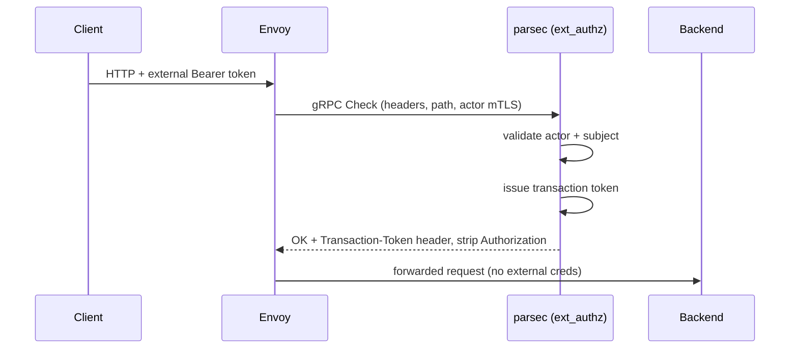
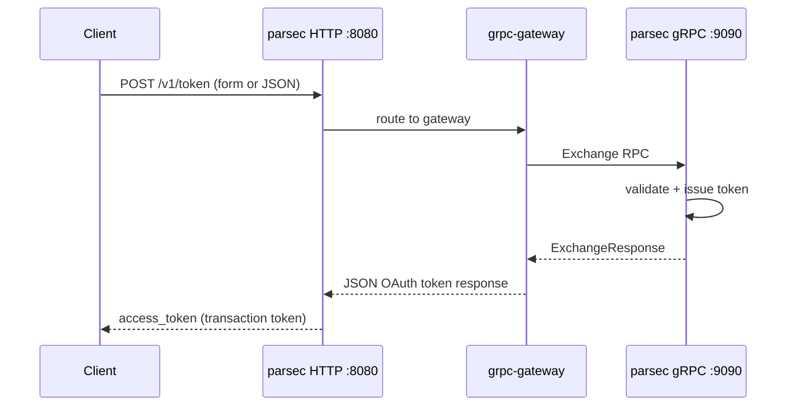

# parsec Entry Points and Flow

A reference for how the parsec binary starts, which services it exposes, and how requests move through validation and token issuance.

## Excalidraw Diagrams

Interactive diagrams live in [`docs/diagrams/`](./diagrams/). Open any `.excalidraw` file in [excalidraw.com](https://excalidraw.com) or the VS Code Excalidraw extension to view or export as PNG/SVG.

| Diagram | File |
|---------|------|
| Entry point overview | [01-entry-point-overview.excalidraw](./diagrams/01-entry-point-overview.excalidraw) |
| `parsec serve` bootstrap | [02-bootstrap-flow.excalidraw](./diagrams/02-bootstrap-flow.excalidraw) |
| Server architecture | [03-server-architecture.excalidraw](./diagrams/03-server-architecture.excalidraw) |
| ext_authz flow | [04-ext-authz-flow.excalidraw](./diagrams/04-ext-authz-flow.excalidraw) |
| Token exchange flow | [05-token-exchange-flow.excalidraw](./diagrams/05-token-exchange-flow.excalidraw) |
| JWKS discovery | [06-jwks-flow.excalidraw](./diagrams/06-jwks-flow.excalidraw) |
| Dual identity model | [07-dual-identity-model.excalidraw](./diagrams/07-dual-identity-model.excalidraw) |
| Token issuance pipeline | [08-token-issuance-pipeline.excalidraw](./diagrams/08-token-issuance-pipeline.excalidraw) |
| Perimeter sequence (Envoy) | [09-perimeter-envoy-sequence.excalidraw](./diagrams/09-perimeter-envoy-sequence.excalidraw) |
| Token exchange sequence | [10-token-exchange-sequence.excalidraw](./diagrams/10-token-exchange-sequence.excalidraw) |

Regenerate all diagrams:

```bash
python3 scripts/generate_excalidraw_diagrams.py
```

---

## Overview

parsec is a gRPC-first service that implements:

1. **Envoy ext_authz** (gRPC) — perimeter authorization
2. **OAuth 2.0 Token Exchange** (HTTP via gRPC transcoding) — RFC 8693 compliant
3. **JWKS discovery** — public keys for verifying issued tokens

Both authorization paths issue **transaction tokens** per the [draft-ietf-oauth-transaction-tokens](https://datatracker.ietf.org/doc/draft-ietf-oauth-transaction-tokens/) specification.

### Key Features

- **Dual identity support**: Subject credentials (end users) and actor credentials (services/machines)
- **Pluggable validation**: JWT (JWKS), JSON, OAuth2 introspection
- **Dynamic claim enrichment**: Lua-scriptable data sources with HTTP/JSON services
- **CEL-based claim mapping**: Flexible policy language for token claims
- **Security boundary**: External credential headers are stripped at the perimeter

---

## 1. Binary Entry Point

Everything starts at `cmd/parsec/main.go`:

```go
package main

import (
	"github.com/project-kessel/parsec/internal/cli"
)

func main() {
	cli.Execute()
}
```

`main` delegates entirely to the Cobra CLI in `internal/cli`.

---

## 2. CLI Layer

The root command defines the product and wires subcommands (`internal/cli/root.go`):

| Command | Purpose |
|---------|---------|
| `parsec` | Root — OAuth 2.0 Token Exchange and ext_authz service |
| `parsec serve` | Start the gRPC and HTTP servers |

Global flags:

- `--config` / `-c` — config file path (falls back to `PARSEC_CONFIG` env var)

Today there is **one operational subcommand**: `parsec serve`.

---

## 3. `parsec serve` — Bootstrap Flow

> **Diagram:** [02-bootstrap-flow.excalidraw](./diagrams/02-bootstrap-flow.excalidraw)

`runServe` in `internal/cli/serve.go` is the real application entry. Startup follows this sequence:

```
┌─────────────────────────────────────────────────────────────────┐
│  parsec serve                                                   │
├─────────────────────────────────────────────────────────────────┤
│  1. Load config (file → env PARSEC_* → CLI flags)               │
│  2. config.Provider builds components:                          │
│     • Observer (logging/metrics/tracing)                        │
│     • TrustStore (credential validators)                        │
│     • TokenService (issuance orchestration)                     │
│     • IssuerRegistry, DataSourceRegistry, ClaimsFilterRegistry  │
│  3. Create handlers:                                            │
│     • AuthzServer (ext_authz)                                   │
│     • ExchangeServer (RFC 8693 token exchange)                  │
│     • JWKSServer (public key discovery)                         │
│  4. Start JWKS background cache refresh                         │
│  5. Bind TCP listeners (gRPC + HTTP ports)                      │
│  6. server.New(...).Start() — register services, launch servers │
│  7. srv.SetReady() — flip health to SERVING                     │
│  8. Block on SIGINT/SIGTERM → graceful shutdown                 │
└─────────────────────────────────────────────────────────────────┘
```

### Configuration Precedence

Highest wins:

1. Command-line flags
2. Environment variables (`PARSEC_*`)
3. Configuration file (`--config` or `PARSEC_CONFIG`)
4. Built-in defaults

### Default Ports

| Protocol | Default Port | Services |
|----------|--------------|----------|
| gRPC | `9090` | ext_authz, TokenExchange, JWKS, Health, Reflection |
| HTTP | `8080` | Token exchange, JWKS, health probes (via grpc-gateway) |

---

## 4. Server Architecture — Dual Protocol Stack

> **Diagram:** [03-server-architecture.excalidraw](./diagrams/03-server-architecture.excalidraw)

`internal/server/server.go` runs **two listeners** that share the same business logic:

```
                    ┌──────────────────────────────────┐
  Envoy / gRPC      │         gRPC Server              │
  clients ─────────▶│  • ext_authz (Authorization)   │
                    │  • TokenExchangeService        │
                    │  • JWKSService                 │
                    │  • grpc.health.v1.Health       │
                    │  • reflection                  │
                    └──────────────┬───────────────────┘
                                   │ grpc-gateway dials
                                   │ passthrough:///127.0.0.1:grpcPort
                    ┌──────────────▼───────────────────┐
  HTTP clients ────▶│         HTTP Server              │
                    │  GET  /healthz/live              │
                    │  GET  /healthz/ready             │
                    │  POST /v1/token                  │
                    │  GET  /v1/jwks.json              │
                    │  GET  /.well-known/jwks.json     │
                    │  (+ /metrics etc. via observer)  │
                    └──────────────────────────────────┘
```

### Key Design Decision

**No separate HTTP handler implementations.** HTTP routes are generated from proto annotations (`google.api.http`) and forwarded to the same gRPC handlers via grpc-gateway. This gives:

- Single code path for business logic
- Consistent type definitions across protocols
- RFC 8693 form-encoded support via a custom marshaler

---

## 5. The Three Service Entry Points

### A. Envoy ext_authz — `AuthzServer.Check`

> **Diagrams:** [04-ext-authz-flow.excalidraw](./diagrams/04-ext-authz-flow.excalidraw) · [09-perimeter-envoy-sequence.excalidraw](./diagrams/09-perimeter-envoy-sequence.excalidraw)

| Property | Value |
|----------|-------|
| **Protocol** | gRPC only |
| **Proto** | `envoy.service.auth.v3.Authorization` |
| **Caller** | Envoy at the perimeter |
| **Handler** | `internal/server/authz.go` |

#### Request Flow

```
Envoy CheckRequest
    │
    ├─► buildRequestAttributes()     (method, path, headers, IP, extensions)
    ├─► [optional auth check]        if path matches & no credentials → OK (pass-through)
    ├─► extractActorCredential()     (mTLS cert or Bearer from gRPC metadata)
    ├─► trustStore.Validate(actor)   → actor Result (or anonymous)
    ├─► trustStore.ForActor(actor)   → filtered validator set
    ├─► extractCredential()          (Bearer from Authorization header)
    ├─► filteredStore.Validate(subject)
    ├─► tokenService.IssueTokens()
    └─► CheckResponse OK:
          • add Transaction-Token (or configured) header
          • remove external credential headers (security boundary)
```

On failure, returns a **denied** response with an appropriate gRPC status code (`Unauthenticated`, `PermissionDenied`, etc.).

**Anonymous subject policy:** When `authz_server.anonymous_subject_policy` is configured, requests without subject credentials are evaluated against a CEL expression that has access to `actor` (validated actor result) and `request` (method, path, headers, additional context). Actor extraction runs first, then the policy decides whether anonymous access is allowed. Non-canonical paths (percent-encoding, traversal, double slashes) are rejected before CEL evaluation. If credentials are present, the full validation and token issuance pipeline runs normally. See [configs/README.md](../configs/README.md).

#### Security Boundary

External credential headers (e.g. `authorization`) are **removed** from the forwarded request. Only the issued transaction token reaches backend services. This prevents credential leakage past the perimeter.

---

### B. Token Exchange — `ExchangeServer.Exchange`

> **Diagrams:** [05-token-exchange-flow.excalidraw](./diagrams/05-token-exchange-flow.excalidraw) · [10-token-exchange-sequence.excalidraw](./diagrams/10-token-exchange-sequence.excalidraw)

| Property | Value |
|----------|-------|
| **gRPC** | `parsec.v1.TokenExchangeService.Exchange` |
| **HTTP** | `POST /v1/token` (JSON or `application/x-www-form-urlencoded`) |
| **Spec** | RFC 8693 |
| **Handler** | `internal/server/exchange.go` |

#### Request Flow

```
ExchangeRequest (grant_type, subject_token, audience, scope, request_context, ...)
    │
    ├─► validate grant_type = urn:ietf:params:oauth:grant-type:token-exchange
    ├─► extractActorCredential() + validate actor
    ├─► parse/filter request_context (base64 JSON → claims filter by actor)
    ├─► trustStore.ForActor(actor)
    ├─► validate subject_token as BearerCredential
    ├─► determine requested token type (default: transaction token)
    ├─► validate audience matches trust domain
    ├─► tokenService.IssueTokens()
    └─► ExchangeResponse (access_token, issued_token_type, expires_in, ...)
```

#### Example HTTP Request

```bash
curl -X POST http://localhost:8080/v1/token \
  -H "Content-Type: application/x-www-form-urlencoded" \
  -d "grant_type=urn:ietf:params:oauth:grant-type:token-exchange" \
  -d "subject_token=eyJhbGc..." \
  -d "subject_token_type=urn:ietf:params:oauth:token-type:jwt" \
  -d "audience=https://api.example.com"
```

This is the path for **direct HTTP clients** (curl, services calling `/v1/token`) rather than Envoy.

---

### C. JWKS Discovery — `JWKSServer.GetJWKS`

> **Diagram:** [06-jwks-flow.excalidraw](./diagrams/06-jwks-flow.excalidraw)

| Property | Value |
|----------|-------|
| **gRPC** | `parsec.v1.JWKSService.GetJWKS` |
| **HTTP** | `GET /v1/jwks.json` or `GET /.well-known/jwks.json` |
| **Handler** | `internal/server/jwks.go` |

Returns cached public keys from all configured issuers (for verifying signed transaction tokens). A background ticker refreshes the cache; the first request can trigger a synchronous refresh if the cache is empty.

---

## 6. Shared Request Processing Model

> **Diagram:** [07-dual-identity-model.excalidraw](./diagrams/07-dual-identity-model.excalidraw)

Both **ext_authz** and **token exchange** follow the same dual-identity pattern.

### Dual Identity Model

| Identity | Source | Role |
|----------|--------|------|
| **Actor** | mTLS client cert or Bearer in gRPC metadata | Who is calling parsec (gateway, service) |
| **Subject** | Bearer token in HTTP headers (authz) or `subject_token` (exchange) | End user / principal being authorized |

This enables patterns like "service X acting on behalf of user Y," which is critical for microservice architectures.

### Actor Extraction

`internal/server/actor_credential.go` — `extractActorCredential()`:

1. Try mTLS peer certificate → `MTLSCredential`
2. Else try `authorization: Bearer` in gRPC metadata → `BearerCredential`
3. Else anonymous actor (`trust.AnonymousResult()`)

### Trust Store

`internal/trust/store.go` — the `Store` interface:

- **Validate** — routes credentials to the appropriate validator (JWT/JWKS, JSON, introspection, etc.)
- **ForActor** — returns a filtered store containing only validators the actor is permitted to use (CEL-based policy)

---

## 7. Token Issuance Pipeline (Core Business Logic)

> **Diagram:** [08-token-issuance-pipeline.excalidraw](./diagrams/08-token-issuance-pipeline.excalidraw)

Both entry points converge on `TokenService.IssueTokens()` in `internal/service/service.go`:

```
IssueRequest { Subject, Actor, RequestAttributes, TokenTypes, Scope }
    │
    ▼
For each requested token type:
    issuerRegistry.GetIssuer(tokenType)
        │
        ▼
    Issuer.Issue(ctx, IssueContext)
        │
        ├─► Claim mappers (CEL) build tctx + req_ctx claims
        │     └─► DataSources (Lua/HTTP) enrich lazily during mapping
        ├─► Sign JWT (TransactionTokenIssuer) or unsigned token
        └─► Return Token { Value, IssuedAt, ExpiresAt }
```

### Layered Issuance Steps

```
1. Credential Extraction
   └─> Strongly-typed credentials (Bearer, JWT, JSON, mTLS, etc.)

2. Validation (trust.Validator → trust.Store)
   └─> Validated identity (trust.Result with claims)
   └─> Optional actor-based filtering (ForActor method)

3. Data Enrichment (service.DataSource)
   └─> Fetch additional context from external sources
   └─> Lua-scriptable with HTTP/JSON services
   └─> Lazy evaluation during claim mapping

4. Claim Mapping (service.ClaimMapper)
   └─> Build transaction context (tctx) and request context (req_ctx)
   └─> CEL expressions for flexible policy logic

5. Token Issuance (service.Issuer)
   └─> Sign and mint transaction tokens (JWT)
   └─> Support for unsigned tokens (development/testing)
```

The `TransactionTokenIssuer` (`internal/issuer/txn_token.go`) produces signed JWTs with claims including `sub`, `aud` (trust domain), `tctx`, `req_ctx`, and a UUID transaction ID.

---

## 8. Health and Observability Entry Points

| Endpoint | Purpose |
|----------|---------|
| gRPC `grpc.health.v1.Health` | Per-service + aggregate `readiness` |
| `GET /healthz/live` | Process is up (always 200) |
| `GET /healthz/ready` | All services SERVING (503 until `SetReady()`) |
| Observer-configured routes | e.g. `/metrics` for Prometheus |

Readiness stays `NOT_SERVING` until all components are wired and `srv.SetReady()` is called after startup.

Registered health services:

- `envoy.service.auth.v3.Authorization`
- `parsec.v1.TokenExchangeService`
- `parsec.v1.JWKSService`

---

## 9. End-to-End Sequence Diagrams

### Perimeter Flow (Envoy)



### Direct Token Exchange Flow



---

## 10. Project Structure (Relevant Paths)

```
parsec/
├── cmd/parsec/
│   └── main.go                   # Process entry point
├── internal/
│   ├── cli/
│   │   ├── root.go               # Cobra root command
│   │   └── serve.go              # serve subcommand + bootstrap
│   ├── server/
│   │   ├── server.go             # gRPC + HTTP server setup
│   │   ├── authz.go              # ext_authz implementation
│   │   ├── exchange.go           # Token exchange implementation
│   │   ├── jwks.go               # JWKS discovery
│   │   ├── actor_credential.go   # Actor identity extraction
│   │   └── form_marshaler.go     # RFC 8693 form encoding
│   ├── service/
│   │   ├── service.go            # TokenService orchestration
│   │   └── issuer.go             # Issuer interface
│   ├── trust/                    # Credential validation
│   ├── issuer/                   # Token issuer implementations
│   ├── mapper/                   # CEL claim mappers
│   ├── datasource/               # Lua/HTTP data enrichment
│   └── config/                   # Configuration loading
├── api/parsec/v1/
│   ├── token_exchange.proto      # Token exchange + HTTP annotations
│   └── jwks.proto                # JWKS + HTTP annotations
└── configs/                      # Example configuration files
```

---

## 11. Quick Reference

| Layer | Entry |
|-------|-------|
| **Process** | `cmd/parsec/main.go` → `cli.Execute()` |
| **Command** | `parsec serve` |
| **gRPC services** | ext_authz, TokenExchange, JWKS, Health, Reflection |
| **HTTP routes** | `/v1/token`, `/v1/jwks.json`, `/.well-known/jwks.json`, `/healthz/*` |
| **Shared core** | TrustStore → TokenService → IssuerRegistry → signed transaction tokens |

### Primary Authorization Entry Points

| Entry Point | Protocol | Use Case |
|-------------|----------|----------|
| `AuthzServer.Check` | gRPC | Envoy perimeter — strips external credentials |
| `ExchangeServer.Exchange` | gRPC + HTTP | RFC 8693 token exchange for direct callers |
| `JWKSServer.GetJWKS` | gRPC + HTTP | Public key discovery for token verification |

Both authorization paths share the same validation, actor filtering, and issuance pipeline underneath.

---

## Building and Running

```bash
# Generate proto code
make proto

# Build
make build

# Run
./bin/parsec serve

# With config override
./bin/parsec serve --config /etc/parsec/config.yaml --server-grpc-port 9091
```
