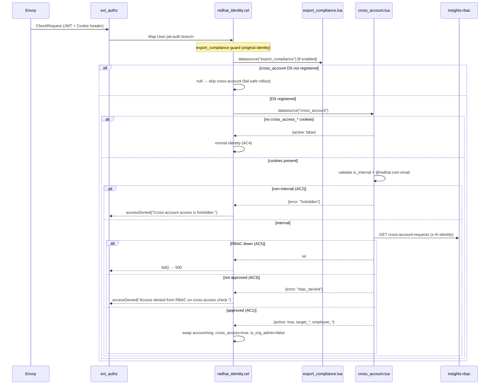

# RHCLOUD-47320: Cross-account / org-admin access checks

**JIRA**: https://redhat.atlassian.net/browse/RHCLOUD-47320
**PR**: https://github.com/project-kessel/parsec/pull/206
**Status**: In re-review on [#206](https://github.com/project-kessel/parsec/pull/206)
(`parsec-CAR` @ `6c286fc`, local). Sep 10 security fixes + Sep 15 parity follow-ups
(Steps 10–12) landed locally; push + GitHub thread replies pending. App-interface
required after merge. Deploy script mount split to [#210](https://github.com/project-kessel/parsec/pull/210).

**Last PR comment check**: 2026-09-15 12:39 UTC — no new inline comments since
@jharting org_id-only query mode.

## PR Review Feedback

### 2026-09-10 — @coderbydesign + CodeRabbit

Latest review on [#206](https://github.com/project-kessel/parsec/pull/206) from
**@coderbydesign** (2026-09-10) and **CodeRabbit** (2026-09-09). Treat security
items as **blocking** until fixed and covered by tests.

### Blocking — security / 3scale parity

| # | Source | File | Issue | Required fix |
|---|--------|------|-------|--------------|
| S1 | CodeRabbit 🔴 | `cross_account.lua` L335–341, `redhat_identity.cel` L159–161 | **Authorization bypass (IDOR)** | ✅ Fixed in `d549f48` + `e494d6a` |
| S2 | @coderbydesign | `cross_account.lua` L281–283 | **Defense-in-depth gap vs 3scale L548** | ✅ Fixed in `d549f48` + `addb672` |

### Must-do — AC8 audit logging

| # | Source | Issue | Required fix |
|---|--------|-------|--------------|
| A1 | @coderbydesign (review summary) | No audit logging for **denied**, **RBAC-denied**, or **granted** cross-account attempts, unlike 3scale. | ✅ `FetchAudit` probe + `cross_account.lua` audit table (`c130661`) |

### Should-do — review questions (respond or fix)

| # | Source | File | Question / concern | Plan action |
|---|--------|------|-------------------|-------------|
| Q1 | @coderbydesign | `redhat_identity.cel` L158 | Asymmetry resolved — both fields now come from validated RBAC-bound DS output only. | ✅ Fixed `e494d6a`; replied Sep 14 |
| Q2 | @coderbydesign | `redhat_identity.cel` L148 | `datasource()` is **memoized per CEL evaluation** (`internal/cel/mapper_input.go` `lib.cache`; see `internal/cel/README.md`). Repeated `datasource("cross_account")` in one mapper eval invokes RBAC once. | ✅ Replied Sep 14 — no code change |
| Q3 | @coderbydesign / @jharting | `cross_account.lua` `fetch_cache_key` | 3scale does not cache RBAC. @coderbydesign flagged fail-open on revocation; **@jharting Sep 15 agreed** — TAM path is rare, no need to optimize beyond 3scale. | ✅ Fixed `26de316` — removed DS caching + `fetch_cache_key` |
| Q4 | CodeRabbit | `cross_account.lua` L230–233 | Redundant `://` branch | ✅ Fixed in `5ce35f3` |
| Q5 | @jharting | `parsec-production.yaml` L49–53 | What is `PARSEC_RBAC_AUTHORIZATION` / `http_auth` for? 3scale sends only `x-rh-identity` to RBAC. | ✅ Fixed `2d6eacc` — removed rbac `http_auth` from examples |
| Q6 | @jharting / @coderbydesign | `cross_account.lua` L14 `cross_access_query_by` | @coderbydesign Sep 14: dual mode is legacy. **@jharting Sep 15 12:39: simplify to org_id query mode only** (drop account mode and config toggle). | ✅ Fixed `6c286fc` — org_id-only RBAC query |
| Q7 | @jharting | `deploy/parsec.yaml` | Chicken-egg: mount fails unless app-interface secret has subpath. | ✅ Split to [#210](https://github.com/project-kessel/parsec/pull/210); removed from #206 (`4d7c6cd`) |

### 2026-09-14 — 2026-09-15 — @jharting + @coderbydesign (thread replies)

| Date | Reviewer | Topic | Decision / action |
|------|----------|-------|-------------------|
| Sep 14 | @Adam0Brien | Q2 memoization | Replied on thread — `fetchDatasource` / `lib.cache` |
| Sep 14 | @Adam0Brien | Q1 org_id fallback | Replied — removed legacy fallback (`e494d6a`) |
| Sep 14 | @Adam0Brien | Deploy mount chicken-egg | Pointed to [#210](https://github.com/project-kessel/parsec/pull/210) |
| Sep 14 | @coderbydesign | `cross_access_query_by` | Legacy dual mode — **superseded by org_id-only** (Q6, @jharting Sep 15) |
| Sep 15 | @jharting | RBAC DS caching (Q3) | **Agreed: match 3scale — do not cache RBAC results** |
| Sep 15 | @jharting | `http_clients.rbac.http_auth` | Question raised — 3scale uses `x-rh-identity` only; drop example auth header |
| Sep 15 | @jharting | `cross_access_query_by` (Q6) | **Org_id query mode only** — remove account mode + config toggle |

### Pending PR thread replies (after Steps 10–12 land)

| Thread | Reviewer | Reply needed |
|--------|----------|--------------|
| S2 / 3scale L548 | @coderbydesign | Fixed in `d549f48` + `addb672` — RBAC record binding + cookie match tests |
| Q3 RBAC caching | @coderbydesign / @jharting | Removing DS cache per @jharting Sep 15 agreement (3scale parity) |
| Q5 `http_auth` | @jharting | Removing `PARSEC_RBAC_AUTHORIZATION`; RBAC auth is `x-rh-identity` only |
| Q6 query mode | @jharting / @coderbydesign | Org_id-only RBAC query; dropping `cross_access_query_by` toggle |

### Non-blocking — automated review

| Source | Item | Notes |
|--------|------|-------|
| CodeRabbit | Merge risk | **⚪ Minimal** on latest review (Sep 14, through `4d7c6cd`) after S1/S2 fixes |
| CodeRabbit | Pre-merge checklist | PR description / ticket ref incomplete; docstring coverage warning — process, not blocking code |
| Codecov | Patch coverage | Fixture helpers (`jwks_fixture.go`, etc.); low priority unless touching again |

## Remaining Work (before merge)

Single PR on `parsec-CAR` ([#206](https://github.com/project-kessel/parsec/pull/206)). Core flow
is implemented and hermetically tested.

**Next step**: Reply on open GitHub threads (S2, Q3, Q5, Q6) after push.

Production rollout still requires **app-interface** secret updates (separate repo).

### Must-do (blocking merge in parsec repo)

- [x] **`cross_account.lua`**: send `x-rh-identity` (base64 employee identity, pre-swap) on RBAC `GET`
- [x] **`rbac_path`**: full URL in config until [PR #201](https://github.com/project-kessel/parsec/pull/201) (`base_url` + relative path) merges
- [x] **Remove RBAC DS caching** (Q3): drop `caching:` + `fetch_cache_key` from all `cross_account` DS configs (`26de316`)
- [x] **Remove rbac `http_auth`** (Q5): drop `PARSEC_RBAC_AUTHORIZATION` from `parsec-production.yaml` and README (`2d6eacc`)
- [x] **Org_id-only RBAC query** (Q6): remove `cross_access_query_by`; always `org_id=` from target org cookie (`6c286fc`)
- [x] **Hermetic tests**: Lua unit, CEL unit, ext_authz e2e (including SA skip + compliance ordering)
- [x] **`deploy/parsec.yaml` mount**: moved to [#210](https://github.com/project-kessel/parsec/pull/210) (not in #206)

### Depends on follow-up PR

- [ ] **[PR #201](https://github.com/project-kessel/parsec/pull/201) / RHCLOUD-50834**: `http_clients[].base_url` for relative `rbac_path` (and `export_compliance` path). After merge, switch configs from full `rbac_path` URLs to `base_url` + `/api/rbac/v1/cross-account-requests/`.

### Should-do (AC / parity)

- [x] E2E: service-account path does not invoke cross-account
- [x] E2E: compliance runs on original identity before cross-account swap
- [ ] Confirm `employee_account_number` / `employee_org_id` placement vs 3scale `x-rh-identity` shape (currently at identity root in CEL; matches JIRA wording)
- [x] **AC8 audit** (blocking per @coderbydesign): `FetchAudit` probe + cross_account audit table on forbidden / rbac_denied / approved / infra
- [x] **S1/S2**: bind target identity to RBAC record; deny cookie/RBAC mismatch; regression tests added
- [x] **Q2**: CEL `datasource("cross_account")` memoized per evaluation (`mapper_input.go` cache); replied Sep 14
- [x] **Q3**: remove RBAC DS caching to match 3scale (@jharting agreed Sep 15); JIRA AC9 caching superseded by 3scale parity (`26de316`)
- [x] **Q4**: remove redundant `resolve_rbac_url` branch
- [x] **Q5**: remove spurious `http_clients.rbac.http_auth` from prod example / README (`2d6eacc`)
- [x] **Q6**: org_id-only RBAC query — removed `cross_access_query_by` toggle and account branch (`6c286fc`)

### Deploy follow-up (separate repo — required before prod enforcement)

- [ ] App-interface: register `cross_account` DS, `rbac` HTTP client (base URL; `base_url` after #201), script volume mount ([#210](https://github.com/project-kessel/parsec/pull/210)), `identity-policy` toggles. **No** RBAC `http_auth` or DS cache (Q3/Q5). Until applied, DS absent → fail-safe skip.

### Deferred / optional

- [ ] **`deploy/parsec-ephem.yaml`**: ephem template uses inline legacy CEL without CAR guards; use `configs/examples/parsec-cross-account-local.yaml` for local CAR testing instead
- [ ] PR 3: generic parsed `cookies` on `RequestAttributes` (only if Lua cookie parsing becomes a maintenance issue)
- [ ] Resolve open questions in Risks table (exact RBAC auth — **x-rh-identity only per Q5**)

### Done

- [x] `cross_account.lua` — cookies, internal/email checks, RBAC list call, `x-rh-identity`
- [x] `redhat_identity.cel` — guards + swap on console / rhsm / portal jwt-auth branches
- [x] Config: `parsec.yaml`, production example, `parsec-cross-account-local.yaml`, README snippet
- [x] Tests: Lua unit, CEL unit, hermetic ext_authz e2e (fixture RBAC; full URL in `rbac_path` until #201)
- [x] Plan doc `docs/impl-plans/RHCLOUD-47320.md`
**Author**: Adam O'Brien / AI Assistant
**Date**: 2026-09-07

## Context

Legacy `insights-3scale` lets Red Hat internal employees (TAMs, support) access a
customer account on the employee's behalf: the employee authenticates with their
own JWT, browser cookies name the target account/org, RBAC validates an approved
cross-account request, then the gateway rewrites identity. Parsec has no equivalent.

Parent epic: Fix-6 (SSO feature parity). **Depends on** Fix-3 (BOP data source)
and Fix-4 (identity branching) — both are on main (`bop-user` Lua DS,
`redhat_identity.cel` User jwt-auth branches).

Related:
[RHCLOUD-49359](https://redhat.atlassian.net/browse/RHCLOUD-49359) (export
compliance) — compliance must run on the **original** employee identity
**before** any cross-account swap (AC9 there; guard already placed in CEL).

> **Discard prior scaffolding.** Commit `5ec349d` (`internal/server`
> `CredentialContext` / `IdentityMutator` / `RBACService` mock) is the wrong
> layer, does not compile, and must not be wired. Revert or replace those four
> files before implementation.

### Acceptance Criteria

- [ ] AC1: Internal employee + valid cross-account cookies + approved RBAC request
  → identity uses **target** account/org, `internal.cross_access=true`,
  `user.is_org_admin=false`, employee originals preserved in
  `employee_account_number` / `employee_org_id`
- [ ] AC2: Non-internal user + cross-account cookies → **403**
  `"Cross account access is forbidden."`
- [ ] AC3: Internal user + cookies but no approved RBAC request → **403**
  `"Access denied from RBAC on cross-access check."`
- [ ] AC4: No cross-account cookies → normal identity; no cross-account-specific
  fields (`cross_access` stays false; no `employee_*` fields)
- [ ] AC5: RBAC service unavailable → **500** (infrastructure failure, not 403)
- [ ] AC6: Configurable bypass for `is_internal` flag check (email
  `@redhat.com` still required)
- [ ] AC7: ~~Configurable toggle between account-number and org-id RBAC queries~~ — **superseded**: org_id-only query per Sep 15 review (Q6); remove toggle
- [ ] AC8: Audit logging for all cross-account attempts (success and failure) — **implemented** via `FetchAudit` + Lua audit table; verify in stage logs after deploy
- [ ] AC9: Cache RBAC results keyed on employee identity + target cookie values — **under review**: @jharting Sep 15 — align with 3scale (no RBAC cache); may drop AC9 implementation

**JWT-auth User paths only** (console / rhsm / portal jwt-auth branches).
Cert-auth, registry-auth, service accounts, basic-auth, and unsigned-json BOP
path are exempt.

### External References

- [RHCLOUD-47320](https://redhat.atlassian.net/browse/RHCLOUD-47320)
- [insights-rbac cross-account-requests API](https://github.com/redhatinsights/insights-rbac-api-client-ruby/blob/master/docs/CrossAccountRequestApi.md) — `GET /cross-account-requests/` with `query_by=user_id`, `account` / `org_id`, `approved_only=true`
- [insights-3scale](https://github.com/RedHatInsights/insights-3scale) (reference implementation; cookie names and deny strings from JIRA)
- Prior art in this repo: `configs/scripts/bop_user.lua`, `export_compliance.lua`, `docs/impl-plans/RHCLOUD-49359.md`

**Open — please confirm or paste:**

- Google Doc / Confluence spec for exact RBAC URL, auth headers, and org-id query
  parameter name (if different from account mode)
- Whether `employee_account_number` / `employee_org_id` live at identity root or
  under `internal` (3scale parity doc preferred)

## Design

### Server Code vs. Configuration Gate

> **Answer these questions FIRST before proceeding with any design.**

| Question | Answer |
|----------|--------|
| Does this modify server Go code or use configuration/policy? | **Primarily configuration/policy** (Lua DS + CEL). Optional **generic** Go: parsed `cookies` map on `RequestAttributes` so Lua/CEL avoid re-parsing the raw `Cookie` header. **No** cross-account logic in `internal/server`. |
| If server code: is the change generic or specific? | Any Go change is **generic** transport plumbing only. Claim names, cookie names, RBAC URLs, deny strings, and employee checks stay in Lua/CEL/config. |
| Does any proposed server code hardcode claim names, issuer URLs, vendor behaviors, or deployment-specific logic? | **No** — red flag test passes if we keep logic out of server packages. |
| Which existing parsec policy/config layer fits? | **Lua data source** + **CEL `datasource()`** + **`identity-policy` static DS** for toggles. |
| If none: does this need a new abstraction layer? | **No** new policy layer. Existing Lua DS + CEL abort helpers (`accessDenied`, `fail`) suffice. |

### Approach



1. **Lua data source `cross_account`** — validation and RBAC fetch. Returns
   structured JSON (not Go structs):
   - `{ "active": false }` — no `cross_access_account_number` /
     `cross_access_org_id` cookies → CEL no-op (AC4)
   - `{ "error": "forbidden" }` — non-internal employee (AC2)
   - `{ "error": "rbac_denied" }` — RBAC returned no approved request (AC3)
   - `{ "active": true, "target_account_number": "…", "target_org_id": "…",
     "employee_account_number": "…", "employee_org_id": "…" }` — success (AC1)
   - `fetch()` returns **`nil`** only for infrastructure failure (HTTP client
     error, non-parseable response, RBAC 5xx) → CEL `fail()` → 500 (AC5).
     Distinct from `{active:false}`.

2. **CEL `redhat_identity.cel`** — on each **User jwt-auth** branch (console,
   rhsm, portal), **after** the existing `export_compliance` guard and
   **before** emitting the identity map:
   - Null-safe: `datasource("cross_account") != null && …`
   - Map `error` values to `accessDenied()` with the **exact JIRA strings**
   - On `active == true`, override `account_number`, `org_id`,
     `internal.org_id`, `internal.cross_access`, `user.is_org_admin`, and set
     `employee_account_number` / `employee_org_id` from DS result
   - Unsigned-json BOP branch: **skip** cross-account (not browser JWT flow)

3. **`identity-policy` static DS** — extend with cross-account toggles (AC6):
   - `cross_access_bypass_is_internal` (bool, default `false`)
   - RBAC list query uses **`org_id=` from target org cookie only** (Sep 15 review —
     drop `cross_access_query_by` account/org toggle)
   - Reuse existing `internal_idp_target` / `role_fallback_enabled` for
     `is_internal` resolution (same logic as CEL today)

4. **Cookie input** — `buildRequestAttributes` already passes the raw `cookie`
   header in `request_attributes.headers`. Lua parses `cross_access_*` values
   from that header (no server special-casing). Optional follow-up: generic
   `cookies map[string]string` on `RequestAttributes` for reuse.

5. **Fail-safe rollout** — absent `cross_account` DS entry → `datasource()`
   is null → CEL skips all cross-account logic (same pattern as export
   compliance). New behavior activates when app-interface registers the DS.

6. **Ordering** — export compliance → cross-account → identity output. Already
   documented in `export_compliance.lua` and `redhat_identity.cel` headers.

### Alternatives Considered

| Alternative | Pros | Cons | Why not |
|-------------|------|------|---------|
| Go `CredentialContext` identity mutation (`5ec349d`) | Familiar to gateway devs | Wrong layer; unwired; doesn't reach issuance; vendor-specific fields on transport struct | Rejected — JIRA specifies Lua + CEL |
| CEL-only (parse cookies in CEL) | No Lua | No HTTP client, no cache key, no structured RBAC errors | Rejected — RBAC belongs in Lua DS |
| Pre-issuance Go policy hook | Centralized | New abstraction; duplicates mapper inputs | Rejected — CEL mapper is the policy layer |
| Deny when cookies present but DS missing | Stricter | Breaks fail-safe deploy ordering | Rejected — match compliance fail-safe |
| Split Base64Service-style generic PR | Clean abstraction review | No new generic primitive needed | N/A |

### Interface Changes

**None required** for the core feature. Optional generic addition:

```go
// internal/request/request.go — optional PR 1a
type RequestAttributes struct {
    // ...
    Cookies map[string]string `json:"cookies,omitempty"` // parsed from Cookie header
}
```

Populated in `buildRequestAttributes` via existing `parseCookies`; passed
through to Lua `request_attributes.cookies` and CEL `request.cookies`. No
cross-account names in Go.

### Package Impact

| Package | Change Type | Description |
|---------|------------|-------------|
| `configs/scripts` | **New** | `cross_account.lua` |
| `configs/scripts` | **Modified** | `redhat_identity.cel` — cross-account guards + identity swap on User jwt-auth branches |
| `configs/` | **Modified** | Register `cross_account` DS; extend `identity-policy` data |
| `internal/datasource` | **New tests** | `cross_account_lua_test.go` (hermetic HTTP fixtures) |
| `configs/scripts` | **New tests** | CEL cases in `redhat_identity_test.go` |
| `test/e2e` | **New** | `hermetic_authz_cross_account_test.go` |
| `internal/request` | **Optional Modified** | Generic parsed cookies on `RequestAttributes` |
| `internal/server` | **Revert** | Remove `5ec349d` scaffolding if present on branch |
| `deploy/` | **Modified** | Example mounts / ephem config (follow deploy-config-sync rule) |

## Implementation Steps

Work starts from `origin/main`. **Do not** build on commit `5ec349d`.

### PR 1: Cross-account Lua data source + config

#### Step 1: Revert throwaway Go scaffolding

**Package**: `internal/server`
**Files**: Remove or revert `identity_mutation.go`, `rbac_mock.go`,
`cross_account_test.go`, and cross-account fields on `CredentialContext` from
`5ec349d` if present on the working branch.
**Status**: Done (scaffolding absent on `parsec-CAR`)

#### Step 2: Implement `cross_account.lua`

**Package**: `configs/scripts`
**Files**: `cross_account.lua`
**Status**: Done

**Behavior**:

- Read cookies from `input.request_attributes.headers.cookie` (parse
  `cross_access_account_number`, `cross_access_org_id`)
- Resolve employee identity from `input.subject.claims` (account, org, email,
  `is_internal` using same rules as CEL / `identity-policy` config)
- Enforce `@redhat.com` email suffix always; honor
  `identity-policy.cross_access_bypass_is_internal` when set
- Call RBAC `GET {rbac_path}` with `query_by=user_id`, employee user id,
  `approved_only=true`, and **`org_id=` from target org cookie** (org_id-only
  query mode per Sep 15 review)
- **PR review fix (S1/S2)**: parse first approved RBAC record from `data[]` and
  bind `target_account_number` / `target_org_id` from that record; deny when
  cookies disagree with the record (3scale auth.lua L548 parity)
- Return structured result table (see Approach); `nil` on infrastructure failure
- `fetch_cache_key`: employee `sub`/`user_id` + target cookie values (AC9) — **pending removal** per Sep 15 review (3scale parity)

**Config keys** (Lua `config.get`):

| Key | Default | Purpose |
|-----|---------|---------|
| `rbac_path` | `/api/rbac/v1/cross-account-requests/` | Path or full URL |
| `approved_only` | `"true"` | RBAC query param |

HTTP client: dedicated `rbac` client or shared host — TBD from external spec.

#### Step 3: Hermetic Lua unit tests

**Package**: `internal/datasource`
**Files**: `cross_account_lua_test.go`
**Status**: Done

Cases: no cookies (active false), non-internal (forbidden), RBAC empty (denied),
RBAC approved (success), RBAC 503 (infra), cache key composition, bypass
`is_internal` with/without `@redhat.com`.

#### Step 4: Wire data source + identity-policy extensions

**Package**: `configs/`
**Files**: `parsec.yaml`, `configs/examples/parsec-production.yaml`,
`configs/README.md`
**Status**: Done

```yaml
# identity-policy static data — add:
cross_access_bypass_is_internal: false
# RBAC query: org_id from target cookie only (no cross_access_query_by toggle)

# new DS:
- name: cross_account
  type: lua
  script_file: ./configs/scripts/cross_account.lua
  http_client: rbac              # or entitlements if same host — confirm
  config:
    rbac_path: "/api/rbac/v1/cross-account-requests/"
  # caching: omitted — match 3scale (no RBAC result cache); see Q3 Sep 15 review
```

---

### PR 2: CEL identity mutation + end-to-end tests

Depends on PR 1 (DS must exist for integration tests; CEL null-guards still
compile without it).

#### Step 5: Extend `redhat_identity.cel`

**Package**: `configs/scripts`
**Files**: `redhat_identity.cel`
**Status**: Done

For **console**, **rhsm**, and **portal** User jwt-auth branches only:

1. Keep existing `export_compliance` guard unchanged (before cross-account).
2. Add null-safe cross-account guard chain after compliance, before identity map.
3. On success, emit swapped identity with `employee_*` fields and
   `internal.cross_access: true`, `user.is_org_admin: false`.

**CEL deny messages (exact)**:

- `accessDenied("Cross account access is forbidden.")`
- `accessDenied("Access denied from RBAC on cross-access check.")`

**Infrastructure**: `datasource("cross_account") == null` after registered DS
invocation with cookies → `fail("cross_account_check_failed")` (maps to 500).

> **Note**: CEL duplication across three branches matches the export_compliance
> pattern. Consider a shared comment block; CEL has no user-defined functions
> in this mapper.

#### Step 6: CEL unit tests

**Package**: `configs/scripts`
**Files**: `redhat_identity_test.go`
**Status**: Done

One test per AC (1–5, 4) using static/canned `cross_account` DS responses.
Verify exact deny messages, field swap, and absence of `employee_*` when
inactive.

#### Step 7: Hermetic ext_authz e2e

**Package**: `test/e2e`
**Files**: `hermetic_authz_cross_account_test.go`
**Status**: Done

Full path: JWT fixture + cookie header + Lua DS with `httpfixture` RBAC
responses → ext_authz 200/403/500. Include:

- DS absent → normal identity (fail-safe)
- Service account / cert-auth → no cross-account call
- Compliance + cross-account ordering (compliance uses employee identity)

#### Step 8: Deploy template sync

**Package**: `deploy/`
**Files**: `parsec.yaml`, production examples per deploy-config-sync rule
**Status**: Deploy mount split to [#210](https://github.com/project-kessel/parsec/pull/210) (`4d7c6cd` removed from #206); ephem template deferred

---

### PR 3 (optional): Generic cookie plumbing

Only if Lua cookie parsing proves brittle or is needed elsewhere.

#### Step 9: Parsed cookies on `RequestAttributes`

**Package**: `internal/request`, `internal/server`, `internal/datasource`
**Status**: Pending (optional)

Reuse `parseCookies`; expose `request.cookies` in CEL and
`request_attributes.cookies` in Lua. No `cross_access_*` special cases in Go.

---

### PR follow-up on [#206](https://github.com/project-kessel/parsec/pull/206): Sep 15 review parity

Depends on Sep 10 security fixes (already on `parsec-CAR`). Small config/Lua
cleanup PR or additional commits on same branch.

#### Step 10: Remove RBAC DS caching (Q3)

**Package**: `configs/`, `configs/scripts`
**Files**: `parsec.yaml`, `parsec-production.yaml`, `parsec-cross-account-local.yaml`, `cross_account.lua`
**Status**: ✅ Done (`26de316`)

#### Step 11: Remove spurious rbac `http_auth` (Q5)

**Package**: `configs/examples/`, `configs/README.md`
**Files**: `parsec-production.yaml`, README rbac client example
**Status**: ✅ Done (`2d6eacc`)

#### Step 12: Simplify to org_id-only RBAC query (Q6)

**Package**: `configs/scripts`, `configs/`, tests
**Files**: `cross_account.lua`, yaml configs, `cross_account_lua_test.go`, e2e
**Status**: ✅ Done (`6c286fc`)

#### Step 13: Reply on open GitHub threads

**Status**: Pending (push + thread replies)

- S2/L548: point to `d549f48` + `addb672`
- Q3: removing cache per @jharting agreement
- Q5: removing spurious `http_auth`; `x-rh-identity` only
- Q6: org_id-only query mode

## Naming

| Entity | Name | Rationale |
|--------|------|-----------|
| Data source | `cross_account` | Matches JIRA feature name; `datasource("cross_account")` |
| Lua script | `cross_account.lua` | Consistent with `export_compliance.lua` |
| Lua result `active` | `active` | Distinguishes no-op from infra `nil` |
| Lua result errors | `forbidden`, `rbac_denied` | CEL maps to exact HTTP 403 strings |
| Identity fields | `employee_account_number`, `employee_org_id` | Per JIRA |
| Config toggle | `cross_access_bypass_is_internal` | Scoped under identity-policy |
| RBAC query param | `org_id` (fixed) | From target org cookie; no account/org toggle |
| Observer | *(none new)* | Reuse `LuaObserver` / `LuaFetchProbe` on DS fetch (AC8) |

## Test Plan

Per `docs/testing.md`: hermetic, no I/O, prefer fakes/fixtures over mocks.

### Unit Tests

| Test | Package | What it verifies |
|------|---------|-----------------|
| `TestCrossAccountLua_NoCookies` | `internal/datasource` | AC4 — `{active:false}` |
| `TestCrossAccountLua_NonInternal` | `internal/datasource` | AC2 — forbidden |
| `TestCrossAccountLua_RBACDenied` | `internal/datasource` | AC3 — rbac_denied |
| `TestCrossAccountLua_RBACApproved` | `internal/datasource` | AC1 — target + employee fields |
| `TestCrossAccountLua_RBACRecordMismatch` | `internal/datasource` | S1/S2 — approved RBAC record but cookie org/account mismatch → deny |
| `TestCrossAccountLua_AccountCookieOnlyEmptyOrg` | `internal/datasource` | S1 — account cookie only, empty org cookie → deny (no employee org fallback) |
| `TestCrossAccountLua_RBACUnavailable` | `internal/datasource` | AC5 — nil fetch |
| `TestCrossAccountLua_CacheKey` | `internal/datasource` | AC9 — employee + cookies (**remove or skip if DS caching dropped — Step 10**) |
| `TestCrossAccountLua_BypassIsInternal` | `internal/datasource` | AC6 — email-only path |
| `TestRedHatIdentityCEL_CrossAccount_*` | `configs/scripts` | CEL mapping per AC |
| `TestHermeticAuthzCrossAccount_*` | `test/e2e` | Full ext_authz status codes |

### Contract Tests

None — no new Go interfaces.

### Benchmarks

Not required unless profiling shows Lua+RBAC on hot path; optional later.

### Integration / E2E

`hermetic_authz_cross_account_test.go` — mirrors
`hermetic_authz_compliance_test.go` structure.

## Observability

Per `docs/observer-pattern.md`. **No new observer types** — existing Lua DS
instrumentation covers AC8:

```text
DataSourceObserver (existing)
└── LuaObserver
    └── LuaFetchProbe  — "lua fetch completed" / errors per DS name
```

### Audit attributes (AC8)

> **PR review (2026-09-10)**: @coderbydesign — audit logging for denied /
> RBAC-denied / granted was missing vs 3scale. **Fixed in `c130661`**: generic
> `FetchAudit` probe + Lua `audit` table on each outcome.

Target audit fields (align with 3scale):

| Outcome | Log level | Attributes |
|---------|-----------|------------|
| Success (`active:true`) | Info | `data_source=cross_account`, `result=approved`, employee id, target account/org |
| Forbidden | Info | `result=forbidden`, employee id, cookie values present |
| RBAC denied | Info | `result=rbac_denied`, employee id, target query value |
| Infrastructure failure | Error | `result=infra_error`, wrapped HTTP status |

**Implemented** (`c130661`): `FetchAudit` on `LuaFetchProbe`; `cross_account.lua`
attaches `audit` table with `event`, `outcome`, `employee_user_id`, target
account/org. Zlog emits at Info (`"lua fetch audit"`). Covers forbidden,
rbac_denied, infra, and approved — including cookie/RBAC mismatch (S2).

### Injection

Existing `LuaDataSourceConfig.Observer` — wire through registry construction
(no change if default composite observer already includes logging).

## Security

- [x] Input validation: cookie values parsed strictly; reject malformed cookie header at transport layer (existing `parseCookies` error path)
- [x] Error handling: JIRA strings are fixed operator-facing messages; RBAC/HTTP internals stay in logs only
- [x] Credential handling: cross-account cookies are **not** credential sources — do not add to `CredentialContext` identity fields
- [x] JWT-auth only: CEL branch gating excludes cert-auth, service accounts, registry-auth
- [x] Fail-closed on RBAC infra failure (500), fail-safe on missing DS (no check)
- [x] **Review gap (S1/S2)**: bind approved target to RBAC record; reject cookie/RBAC mismatch and empty cookies
- [ ] **Review gap (Q3)**: Remove RBAC DS caching to match 3scale (@jharting Sep 15); eliminates revocation fail-open window

## Maintainability

- [x] Constructor pattern: N/A for Lua/CEL; optional Go cookies use existing request builder
- [x] Forward compatibility: null-safe `datasource("cross_account") != null` guards
- [x] Config vs. domain: RBAC URL, toggles, deny strings in Lua/CEL/config only
- [x] Downstream app-interface: required follow-up (see Configuration Impact)

## Configuration Impact

> **Fail-safe rule**: Absent `cross_account` DS → previous behavior (no
> cross-account enforcement). Code deploys before app-interface secrets update.

### Backward Compatibility

| New Field | Type | Default / Zero Value | Behavior When Absent |
|-----------|------|---------------------|-------------------|
| `data_sources[].name: cross_account` | YAML list item | omitted | `datasource()` → null → skip (AC4 unchanged) |
| `identity-policy.cross_access_bypass_is_internal` | bool | `false` | Require `is_internal` + email |
| ~~`cross_access_query_by`~~ | — | removed | Org_id-only query (Sep 15 review) |
| `http_clients[].name: rbac` | client config | omitted | DS cannot register without client — stays skipped |

- [ ] Every new field has a safe default preserving prior behavior
- [ ] No `panic` on missing cross-account config
- [ ] Test: DS absent → identity unchanged vs pre-feature

### Local Config (parsec repo)

| File | Change | Description |
|------|--------|-------------|
| `configs/parsec.yaml` | Add `cross_account` DS + policy fields | Hermetic example |
| `configs/examples/parsec-production.yaml` | Add `cross_account` DS (no caching) | Prod pattern — pending Step 10 |
| `configs/README.md` | Document new DS and toggles | Operator guide |

### Deploy Templates (parsec repo)

| File | Change | Description |
|------|--------|-------------|
| `deploy/parsec-ephem.yaml` | Mount `cross_account.lua`; extend identity-policy | Ephemeral dev |
| `deploy/parsec.yaml` | Script volume mount | [#210](https://github.com/project-kessel/parsec/pull/210) — not #206 |

### Downstream app-interface (follow-up required)

> **Action required after merge**: Register `cross_account` Lua DS, `rbac` HTTP
> client base URL, script volume mount ([#210](https://github.com/project-kessel/parsec/pull/210)),
> and `identity-policy` toggles in stage/prod app-interface secrets. RBAC list
> calls authenticate via `x-rh-identity` only (no separate Authorization header;
> no DS-level RBAC cache). Until updated, parsec skips cross-account (fail-safe).
>
> Refer to `.cursor/rules/deploy-config-sync.mdc` for volume mount ↔ secret
> key parity.

| Environment | What to update |
|-------------|----------------|
| Stage | `cross_account.lua` mount ([#210](https://github.com/project-kessel/parsec/pull/210)); `rbac` http client base URL; identity-policy static data |
| Prod | Same; RBAC base URL via app-interface (no cache TTL) |

## Documentation

### New Documentation

| Doc | Path | Purpose |
|-----|------|---------|
| *(inline)* | `cross_account.lua` header | Flow, config keys, return schema, cache key |

### Documentation Updates

| Doc | Path | What changes |
|-----|------|-------------|
| CEL header | `configs/scripts/redhat_identity.cel` | Cross-account section + ordering |
| Compliance note | `configs/scripts/export_compliance.lua` | Confirm AC9 ordering still accurate |
| Config guide | `configs/README.md` | DS registration example |
| This plan | `docs/impl-plans/RHCLOUD-47320.md` | Status updates during execution |

### Config Examples

See Step 4 YAML snippet above.

## Completeness Checklist

- [x] Server code vs. configuration gate passed
- [x] No new abstraction layer — existing Lua DS + CEL
- [x] Every AC maps to implementation steps / tests
- [x] Naming follows parsec conventions
- [x] No new Go interfaces — NoOp N/A
- [x] Observability via FetchAudit probe for AC8 audit fields (Lua audit table)
- [x] Test cases listed per AC
- [x] Security section addressed
- [x] Documentation steps included
- [x] Config impact + fail-safe documented
- [x] app-interface follow-up explicit
- [x] Split into reviewable PRs (Lua → CEL → optional plumbing)
- [ ] Open questions resolved before Approved (see below)

## Risks & Open Questions

| # | Item | Status | Resolution |
|---|------|--------|------------|
| 1 | Exact RBAC base URL and path for stage/prod | **Open** | Full `rbac_path` until #201; then `base_url` + relative path |
| 2 | Org-id query param name (`org_id` vs `target_org`) | **Resolved — Q6** | Query RBAC with `org_id=` from target org cookie only; drop account mode |
| 3 | Placement of `employee_account_number` / `employee_org_id` in identity JSON | **Open** | Confirm 3scale `x-rh-identity` shape |
| 4 | Cache TTL / AC9 | **Resolved — Q3** | No RBAC DS caching (`26de316`); AC9 superseded by 3scale parity |
| 5 | `http_clients.rbac.http_auth` / `PARSEC_RBAC_AUTHORIZATION` | **Resolved — Q5** | Removed from prod example (`2d6eacc`); `x-rh-identity` only |
| 6 | `cross_access_query_by` dual mode | **Resolved — Q6** | Org_id-only query (`6c286fc`); toggle + account branch removed |
| 7 | CEL `datasource()` memoization per evaluation | **Resolved — Q2** | `mapper_input.go` caches per eval; replied Sep 14 |
| 8 | AC8 explicit audit logs vs generic Lua fetch probe | **Resolved — A1** | `FetchAudit` + cross_account audit fields (`c130661`) |
| 9 | RBAC record must match cookie target (3scale L548 parity) | **Resolved — S2** | `rbac_find_approved_record` + cookie match tests (`addb672`) |
| 10 | Unsigned-json BOP User path — cross-account allowed? | **Resolved** | **No** — JWT browser flow only per JIRA |
| 11 | CEL verbosity (3 duplicated guard blocks) | **Open** | Accept duplication (compliance precedent) or extract shared CEL file later |
| 12 | Commit `5ec349d` on `rhcloud-47320-clean` | **Resolved** | Revert in Step 1 |
| 13 | Deploy mount chicken-egg | **Resolved — Q7** | [#210](https://github.com/project-kessel/parsec/pull/210) |

## Review Log

| Date | Reviewer | Feedback | Changes Made |
|------|----------|----------|--------------|
| 2026-09-07 | — | Plan created from JIRA + prior commit review | Initial draft |
| 2026-09-08 | Adam | Dropped duplicate base_url impl; full rbac_path URLs until #201 | CAR defers RHCLOUD-50834 to follow-on PR |
| 2026-09-09 | CodeRabbit ([#206](https://github.com/project-kessel/parsec/pull/206)) | 🔴 Critical: bind target identity to RBAC record; deny cookie mismatch; require `target_org_id`; remove CEL org fallback. 🟠 Major: reject account-only cookie path. Nit: redundant `://` in `resolve_rbac_url`. | Plan updated — fixes pending |
| 2026-09-10 | @coderbydesign ([#206](https://github.com/project-kessel/parsec/pull/206)) | No audit logging (AC8) vs 3scale. RBAC `#data > 0` weaker than 3scale L548 — add test. Questions: account_number vs org_id conditional asymmetry; CEL DS memoization; RBAC cache TTL vs 3scale no-cache. Overall on right track. | Plan updated — PR Review Feedback section added |
| 2026-09-10 | Implementation | Addressed S1/S2, A1, Q4 (6 commits on `parsec-CAR`) | `5ce35f3`..`c130661` |
| 2026-09-14 | @Adam0Brien | Replied Q1/Q2; split deploy mount to #210 | `4d7c6cd` removes mount from #206 |
| 2026-09-14 | @coderbydesign | `cross_access_query_by` is legacy — not necessary | Superseded by Q6 org_id-only direction |
| 2026-09-15 | @jharting | No RBAC caching beyond 3scale; question rbac `http_auth` | Plan Q3 — drop DS cache; Q5 — drop http_auth example |
| 2026-09-15 | Plan | Latest feedback check | No new comments since jharting 12:39 org_id-only; Steps 10–13 scoped |
