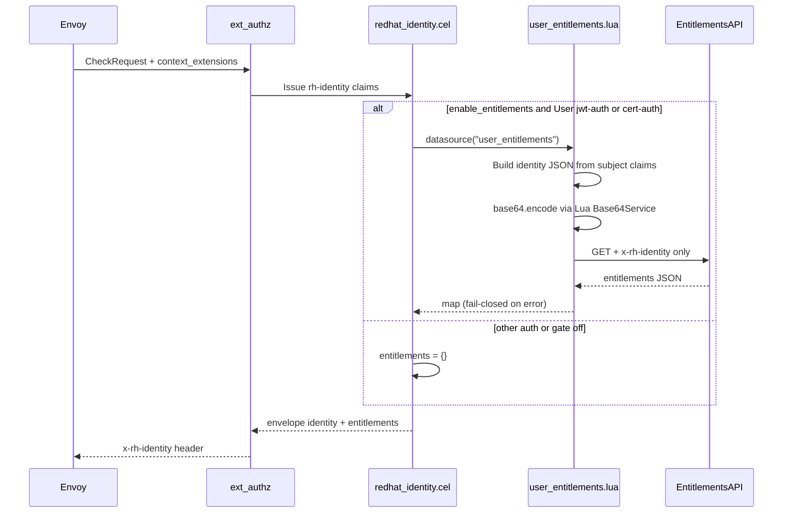

# RHCLOUD-49315: Entitlements injection via Lua data source

**JIRA**: https://redhat.atlassian.net/browse/RHCLOUD-49315
**Status**: Draft
**Author**: Adam O'Brien / AI Assistant
**Date**: 2026-08-14

## Context

Legacy insights-3scale fetches per-user entitlements and attaches them as a top-level `entitlements` sibling on the `x-rh-identity` envelope. Parsec currently hardcodes `"entitlements": {}` in [`configs/scripts/redhat_identity.cel`](../../configs/scripts/redhat_identity.cel) (and the inline copy in [`deploy/parsec-ephem.yaml`](../../deploy/parsec-ephem.yaml)).

Parent epic: [RHCLOUD-43993](https://redhat.atlassian.net/browse/RHCLOUD-43993) (SSO feature parity). Related: [RHCLOUD-47320](https://redhat.atlassian.net/browse/RHCLOUD-47320) (cross-account, Backlog), [RHCLOUD-49359](https://redhat.atlassian.net/browse/RHCLOUD-49359) (compliance, similar Lua+header pattern).

### Acceptance Criteria

- [ ] AC1: Fetch entitlements only for SSO bearer (`jwt-auth` + `User`) and certificate (`cert-auth` when present); other auth types keep `{}`
- [ ] AC2: HTTP GET to entitlements service with only `x-rh-identity` (base64-encoded identity JSON)
- [ ] AC3: Response placed as top-level `entitlements` (sibling of `identity`)
- [ ] AC4: Fail-closed on connection failure, non-200, or malformed JSON
- [ ] AC5: Gated on Envoy `context_extensions` (per-gateway enablement)
- [ ] AC6: Cache by account/org/user identity material; TTL default 5m (existing DS cache default)
- [ ] AC7: Cross-account: fetch for **target** account after swap (depends on RHCLOUD-47320; see Risks)

### External References

None beyond JIRA / sibling tickets.

## Design

### Server Code vs. Configuration

| Question | Answer |
|----------|--------|
| Does this modify server Go code or use configuration/policy? | **Both**, in **one PR**. Entitlements use case is config/policy (Lua DS + CEL + YAML). Outbound `x-rh-identity` needs base64 via a **generic** Lua runtime service (no RH/claim-specific logic). |
| If server code: generic or specific? | **Generic** — `base64.encode` / `base64.decode` for any Lua script (datasources, validators). Reusable by RHCLOUD-49359 compliance and others. |
| Hardcoded claim names / issuer URLs / vendor logic in Go? | **No** — RH claim paths and entitlements URL stay in Lua/CEL/config only. |
| Which existing layer fits? | Lua data source + CEL `datasource()` + `request.additional.context_extensions` for the use case; new Lua service alongside `http` / `json` / `config` for base64. |
| New abstraction layer? | **Yes** — Lua `Base64Service`, but **ship in the same PR** as the entitlements wiring (small generic helper + use case; not worth a separate review cycle). |

**Chosen approach (single PR):**

1. Add Lua `Base64Service` (`base64.encode` / `base64.decode`, standard encoding) in [`internal/lua`](../../internal/lua); register it wherever other Lua services are registered (Lua data sources + Lua validators); document in `internal/lua/README.md`.
2. Add `user_entitlements.lua` using `base64.encode` (no pure-Lua encoder), update CEL/config/deploy/docs/tests.

**Base64 decision (locked):** Do **not** embed a pure-Lua encoder in the entitlements script. Prefer a small generic Go Lua service (`Base64Service`) so encoding is correct, tested once, and reusable (e.g. compliance).

**PR boundary (locked):** One PR — base64 helper is tiny and only motivated here; splitting would add process overhead without a clearer review.

### Approach



1. **Lua `Base64Service`:** `base64.encode(string)` / `base64.decode(string)` using `encoding/base64.StdEncoding`. Register on Lua DS fetch/cache-key states and Lua validator states (same places as `json`).
2. **Lua `user_entitlements`:** From `DataSourceInput.subject.claims`, build `{ "identity": { ... } }`, `json.encode` + `base64.encode`, `http.get(url, {["x-rh-identity"]=b64})`. On non-200 / transport / decode failure → `error(...)` (fail-closed). Return response body as JSON `DataSourceResult`.
3. **CEL:** Replace `"entitlements": {}` on eligible User branches with:
   - Gate: `has(request.additional.context_extensions) && request.additional.context_extensions.enable_entitlements == "true"`
   - When gated on: `datasource("user_entitlements")` must be non-null or `fail("entitlements unavailable")`
   - When gated off or ineligible auth (`registry-auth`, `ServiceAccount`): `{}`
4. **Caching:** `caching.type` + `fetch_cache_key` masking to `account_number` / `org_id` / `user_id`. Default TTL **5m** when `ttl` omitted.
5. **Config:** Wire DS fail-safe — absent extension / gate off → today’s `{}`.

### Alternatives Considered

| Alternative | Pros | Cons | Why not |
|-------------|------|------|---------|
| Pure-Lua base64 in entitlements script | No Go change; matches original JIRA “no new Go” | Duplicated/error-prone; needed again for compliance | Rejected — prefer shared Go Lua service |
| Two PRs (base64 then entitlements) | Cleaner abstraction review | Extra overhead for a tiny helper | Rejected — keep **one PR** |
| Entitlements Go middleware / IssuancePolicy | Centralized | Violates generic-service gate; JIRA specifies Lua+CEL | No |
| `datasource(name, params)` for CEL-built identity | Better cross-account purity | New Go abstraction beyond this ticket | Defer unless 47320 forces it |
| Fail-open on DS errors | Soft dependency | Violates AC4 | No |

### Interface Changes

New Lua global module (no Go exported interface consumers beyond Register):

```go
// internal/lua/base64.go
type Base64Service struct{}
func NewBase64Service() *Base64Service
func (s *Base64Service) Register(L *lua.LState) // sets global "base64"
// Lua: base64.encode(s) -> string; base64.decode(s) -> string | (nil, err)
```

Use case otherwise uses existing `DataSource.Fetch`, CEL `datasource(name)`, Lua `http` / `json` / `base64` / `error()`.

Backward compatible: registering `base64` is additive; scripts that ignore it behave as today.

### Package Impact

| Package / path | Change |
|----------------|--------|
| `internal/lua/base64.go` (+ tests, README) | **New** `Base64Service` |
| `internal/datasource/lua_datasource.go` | Register `base64` on Lua states |
| `internal/trust/lua_validator.go` | Register `base64` on Lua states |
| `configs/scripts/user_entitlements.lua` | **New** Lua DS script |
| `configs/scripts/redhat_identity.cel` | Conditional entitlements |
| `configs/parsec.yaml` (+ examples / ephem) | DS registration + cache; remove example `api_key` |
| `deploy/parsec-ephem.yaml` | Sync inline CEL |
| `configs/README.md`, `internal/datasource/LUA_DATASOURCE.md`, `internal/lua/README.md` | Document base64 + entitlements |
| `test/e2e/` | Fixture-backed entitlements path |

## Implementation Steps

Single PR (atomic: generic `Base64Service` + entitlements Lua/CEL/config/tests).

### PR 1: Entitlements via Lua DS + Base64Service

#### Step 1: Add `Base64Service`

**Package**: `internal/lua`
**Files**: `base64.go`, `base64_test.go`, `README.md`
**Status**: Pending

- Implement `encode` / `decode` with `encoding/base64.StdEncoding`
- Unit tests: empty, known vectors, round-trip, decode error
- Document under Available Services in `internal/lua/README.md`

#### Step 2: Register in Lua runtimes

**Package**: `internal/datasource`, `internal/trust`
**Files**: `lua_datasource.go`, `lua_validator.go`
**Status**: Pending

- Register `NewBase64Service().Register(L)` alongside `json` on fetch, cache-key, and validator script states

#### Step 3: Add `user_entitlements.lua`

**Package**: `configs/scripts`
**Files**: `user_entitlements.lua`
**Status**: Pending

- `config.get("entitlements_api")` (required)
- Build identity from subject claims (User-shaped fields)
- `base64.encode(json.encode(envelope))` — **no** inline encoder
- Single header: `x-rh-identity`
- Fail-closed via `error(...)` on nil response, status ≠ 200, bad JSON
- Return `{ data = response.body, content_type = "application/json" }` verbatim
- `fetch_cache_key`: mask to account_number / org_id / user_id only

#### Step 4: Update `redhat_identity.cel`

**Package**: `configs/scripts`, `deploy`
**Files**: `redhat_identity.cel`, inline CEL in `parsec-ephem.yaml`
**Status**: Pending

- Eligible User `jwt-auth` branches (console / rhsm / customer-portal): gated `datasource("user_entitlements")` or `fail(...)`
- Not eligible: `registry-auth`, `ServiceAccount` → `{}`
- Ready for `cert-auth` when that branch exists
- Keep identity construction unchanged; only replace entitlements literals

#### Step 5: Wire configuration (fail-safe)

**Package**: `configs`
**Files**: `parsec.yaml`, `examples/parsec-production.yaml`
**Status**: Pending

```yaml
data_sources:
  - name: user_entitlements
    type: lua
    script_file: ./configs/scripts/user_entitlements.lua
    config:
      entitlements_api: "https://entitlements.example.internal/api/entitlements/v1/services"
    http:
      timeout: 5s
    caching:
      type: in_memory
      # ttl omitted → 5m default
      group_name: entitlements-cache
```

- **Do not** configure API keys / extra headers (JIRA)
- Absent `enable_entitlements` → `{}`
- Gate off without registering DS → still `{}`

#### Step 6: Hermetic / e2e coverage

**Status**: Pending

- Script unit tests with HTTP fixtures (header-only `x-rh-identity`, fail-closed, cache key)
- E2E: gate off → `{}`; gate on + fixture → entitlements map; gate on + 500 / missing DS → deny; SA → `{}` despite gate on

#### Step 7: Docs

**Status**: Pending

- `configs/README.md` — entitlements DS + `enable_entitlements`
- `internal/datasource/LUA_DATASOURCE.md` — pointer to `user_entitlements.lua`

#### Step 8: Downstream app-interface (follow-up, separate repo)

**Status**: Pending (follow-up)

Per [`.cursor/rules/deploy-config-sync.mdc`](../../.cursor/rules/deploy-config-sync.mdc):

- Add `user_entitlements` DS + script mount/`stringData` for stage and prod
- Set `entitlements_api` via secret/env
- Configure Envoy `context_extensions.enable_entitlements: "true"` only where needed
- Until updated: gate off / no DS → prior behavior (fail-safe)

## Naming

| Entity | Name | Rationale |
|--------|------|-----------|
| Type | `Base64Service` | Matches `JSONService` / `HTTPService` |
| Constructor | `NewBase64Service` | Package convention |
| Lua global | `base64` | Parallel to `json`, `http`, `config` |
| Data source | `user_entitlements` | Matches production example |
| Script | `user_entitlements.lua` | Same |
| Config key | `entitlements_api` | Existing example field (drop `api_key`) |
| Context extension | `enable_entitlements` | Explicit per-gateway boolean string `"true"` |
| Cache group | `entitlements-cache` | Existing example |

## Test Plan

Per [`docs/testing.md`](../testing.md): hermetic, fixtures not mocks.

### Unit Tests

| Test | Package | What it verifies |
|------|---------|------------------|
| `TestBase64Service_Encode` / Decode / RoundTrip / DecodeError | `internal/lua` | Std encoding correctness |
| Lua fixture: 200 + body | `internal/datasource` | Returns JSON; header only `x-rh-identity` |
| Lua fixture: non-200 / transport error | same | `Fetch` error (fail-closed) |
| Lua fixture: malformed body | same | `Fetch` error |
| `fetch_cache_key` | same | Same account/org/user → same key |
| CEL / issuer: gate off | mapper / e2e | `entitlements: {}` |
| CEL: gate on + fixture DS | e2e | Top-level entitlements populated |
| CEL: gate on + missing DS / 5xx | e2e | Fail-closed |
| Auth: ServiceAccount (and registry) | e2e | `{}` despite gate on |

### Contract Tests

N/A — `Base64Service` follows existing Register pattern; no new Go interface contract suite required.

### Benchmarks

N/A.

### Integration / E2E

| Test | What it verifies |
|------|------------------|
| E2E hermetic entitlements | Full ext_authz → decode envelope with/without entitlements |

No new OTel metrics (JIRA out of scope). Existing data-source observers remain sufficient.

## Observability

Per [`docs/observer-pattern.md`](../observer-pattern.md).

No new Observer/Probe types for base64 or entitlements. Rely on existing Lua/HTTP/data-source instrumentation.

## Security

- [ ] Only `x-rh-identity` outbound — no API tokens in script
- [ ] Fail-closed — no empty entitlements on upstream failure when enabled
- [ ] Errors must not dump full identity/PII into client-facing OAuth messages (`fail`/`error` → Internal)
- [ ] TLS to entitlements API via existing HTTP client config as needed
- [ ] Context-extension gate prevents accidental prod fetch before Envoy is configured
- [ ] Base64 service is pure transform — no secrets handling beyond encoding caller-supplied strings

## Maintainability

- [ ] Constructor pattern: `NewBase64Service()` (no options needed)
- [ ] RH-specific claim paths stay in CEL/Lua scripts (config layer), not server packages
- [ ] Fail-safe defaults when DS/extension absent
- [ ] Single reviewable PR (base64 + entitlements)
- [ ] Downstream app-interface impact called out in Step 8

## Configuration Impact

> **Fail-safe rule**: All config changes must be backward compatible — absent fields preserve previous behavior.

### Backward Compatibility

| New Field / knob | Type | Default / Zero Value | Behavior When Absent |
|------------------|------|---------------------|----------------------|
| Lua `base64` global | runtime | registered always when Lua runs | Additive; unused scripts unchanged |
| `enable_entitlements` context extension | string | absent | `entitlements: {}` (current) |
| `data_sources` entry `user_entitlements` | DS config | absent | Safe if gate off; fail-closed if gate on |
| `caching.ttl` | string | omit → 5m | Existing default |

- [ ] Every new field has a safe default that preserves prior behavior
- [ ] No `panic` or `log.Fatal` on missing new config
- [ ] Gate-off / absent-DS behavior matches previous version

### Local Config (parsec repo)

| File | Change | Description |
|------|--------|-------------|
| `internal/lua/base64.go` | New | Generic Lua base64 |
| `configs/scripts/user_entitlements.lua` | New | Lua DS script |
| `configs/scripts/redhat_identity.cel` | Modified | Conditional entitlements |
| `configs/parsec.yaml` / examples | Modified | DS block; remove `api_key` from production example |

### Deploy Templates (parsec repo)

| File | Change | Description |
|------|--------|-------------|
| `deploy/parsec-ephem.yaml` | Modified | Sync CEL |

### Downstream app-interface (follow-up required)

> **Action required after merge**: Update the downstream app-interface secrets to reflect config changes. Until updated, the new code runs with previous behavior (fail-safe). Once config is applied, new behavior activates.
>
> Refer to `.cursor/rules/deploy-config-sync.mdc` for specific paths and validation checks for stage and prod environments.

| Environment | What to update |
|-------------|----------------|
| Stage | `user_entitlements` DS + script mount/`stringData`, `entitlements_api`, Envoy `enable_entitlements` where needed |
| Prod | Same as stage |

`Base64Service` itself has no app-interface impact.

## Documentation

### New Documentation

| Doc | Path | Purpose |
|-----|------|---------|
| This plan | `docs/impl-plans/RHCLOUD-49315.md` | Implementation plan |

### Documentation Updates

| Doc | Path | What changes |
|-----|------|-------------|
| Lua services README | `internal/lua/README.md` | Document `base64` service |
| Config README | `configs/README.md` | Entitlements DS + `enable_entitlements` |
| Lua DS docs | `internal/datasource/LUA_DATASOURCE.md` | Pointer to `user_entitlements.lua` |
| AGENTS.md | `AGENTS.md` | No change |

### Config Examples

See Step 5 YAML snippet.

## Completeness Checklist

- [x] Server vs config gate passed: use case is config/policy; Go change is generic base64 only
- [x] `Base64Service` included in the same PR as the use case (deliberate; helper is small)
- [x] ACs map to implementation steps (AC7 deferred dependency noted)
- [x] Every new exported type/function has a proposed name
- [x] No new Observer interfaces required (N/A)
- [x] Test cases cover base64 + entitlements behavior
- [x] Security implications addressed
- [x] Documentation steps included
- [x] Config impact assessed (local, deploy, app-interface)
- [x] Fail-safe config for entitlements gate/DS
- [x] Single reviewable PR with clear ordered steps
- [x] Plan executable top-to-bottom without ambiguity

## Risks & Open Questions

| # | Item | Status | Resolution |
|---|------|--------|------------|
| 1 | **AC7 cross-account**: subject claims remain employee; identity swap (47320) is CEL-side. Lua built from claims would fetch employee entitlements. | Open / deferred | Ship AC1–AC6 now. When 47320 lands: either (a) call `datasource()` only after swap and teach Lua to prefer validated cross-access cookie targets, or (b) add generic `datasource(name, params)` and pass CEL-built identity. |
| 2 | **cert-auth** not in tree yet | Resolved for plan | Wire jwt User now; add same entitlements expr to cert-auth branch when it exists |
| 3 | Identity reconstruction in Lua may drift from CEL identity shape | Accepted | Keep Lua identity minimal; envelope identity remains CEL-owned |
| 4 | Context extension name `enable_entitlements` | Locked | Change only if platform Envoy already uses a different key |
| 5 | Pure-Lua vs Go base64 | **Resolved** | Go `Base64Service` (not pure-Lua) |
| 6 | One PR vs two for base64 | **Resolved** | Single PR |

## Review Log

| Date | Reviewer | Feedback | Changes Made |
|------|----------|----------|--------------|
| 2026-08-14 | — | Plan drafted via parsec-impl | Initial draft (config-only, pure-Lua base64) |
| 2026-08-14 | Adam | Prefer generic Go Lua `base64` over pure-Lua; treat plan as unimplemented | Adopt `Base64Service`; reset Draft / Pending |
| 2026-08-14 | Adam | Keep this as one PR (not base64 then entitlements) | Collapse to single PR; reject two-PR split |
