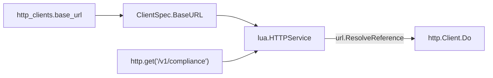

# HTTP-CLIENT-BASE-URL: Shared host on named HTTP clients

**JIRA**: [RHCLOUD-50834](https://redhat.atlassian.net/browse/RHCLOUD-50834) (follow-up to [PR 188](https://github.com/project-kessel/parsec/pull/188) / RHCLOUD-49359; Slack: shared entitlements host for `/services` and `/compliance`)
**Status**: In progress
**Author**: Adam O'Brien
**Date**: 2026-09-02

## Context

Named HTTP clients already share timeout, TLS, auth, and the `*http.Client`
connection pool (`http_client: entitlements` on multiple data sources). The
**host** still lives in each Lua `config` as a full URL (`compliance_api`),
because `*http.Client` has no URL and Lua `http.get` requires an absolute URL.

Jozef/Daniel’s follow-up is a single place for
`https://entitlements.example.com`, with each script supplying a path
(`/v1/compliance` vs `/v1/services`). Same gap as BOP: `bop-user` and cert-auth
duplicate the proxy host in two `config:` blocks.

This plan adds optional `base_url` on the HTTP client spec and resolves
relative Lua URLs against it. Absolute URLs stay valid.

**Out of scope:** Implementing `user_entitlements.lua` (production example is
still a placeholder). Migrating BOP scripts to relative paths (same mechanism,
later ticket).

### Acceptance Criteria

- [ ] AC1: Optional `base_url` on named and inline HTTP clients. Absent/empty preserves today’s behavior (absolute Lua URLs work).
- [ ] AC2: With `base_url` set, Lua `http.get`/`post`/`request` resolve relative URLs against it (`/v1/compliance` → `{base}/v1/compliance`).
- [ ] AC3: Absolute Lua URLs (scheme present) are used as-is even when `base_url` is set (JWT JWKS and existing scripts unchanged).
- [ ] AC4: Relative Lua URL with no `base_url` returns `(nil, error)` from the Lua HTTP service (does not call the network).
- [ ] AC5: Invalid `base_url` (missing scheme or host) fails at **config load / registry build**, not on the first request.
- [ ] AC6: `export_compliance` can use a path-only Lua config while sharing the `entitlements` client’s `base_url`. Full `compliance_api` URLs still work (fail-safe / env overlay).
- [ ] AC7: JWT validators ignore `base_url` (they use `*http.Client` with an absolute JWKS URL).
- [ ] AC8: Test with `base_url` absent matches previous Lua HTTP behavior.

### External References

- [PR 188](https://github.com/project-kessel/parsec/pull/188) — export compliance; named `entitlements` client already wired
- Slack (2026-09-01): Daniel — share HTTP config between `/services` and `/compliance`; Jozef — not possible today (meant **host**, not the client object); follow-up like BOP base URL
- [RHCLOUD-50414](https://redhat.atlassian.net/browse/RHCLOUD-50414) — env-specific hosts belong in namespace variables
- Cursor draft: `http_client_base_url_917055cb.plan.md`

## Design

### Server Code vs. Configuration

> **Answer these questions FIRST before proceeding with any design.**

| Question | Answer |
|----------|--------|
| Does this modify server Go code or use configuration/policy? | **Both**. Generic Go: optional URL join on the existing Lua HTTP service + `base_url` on `HTTPClientSpec`. Deployment hosts/paths stay in YAML/Lua config. |
| If server code: is the change generic (any IdP/vendor/deployment) or specific? | **Generic** — RFC 3986 resolve of relative URLs against a configured base. No entitlements/BOP/compliance strings in Go. |
| Does any proposed server code hardcode claim names, issuer URLs, vendor behaviors, or deployment-specific logic? | **No.** |
| Which existing parsec policy/config layer fits? | Existing `http_clients` registry + Lua `http` service. |
| If none: does this need a new abstraction layer? | **No.** Extends the current HTTP client layer. Split: **PR 1** generic join + config field; **PR 2** compliance path YAML (use case). |

_Parsec is a generic service. Server code must never contain logic specific to
a particular IdP, vendor, or deployment. Use configuration/policy layers for
deployment-specific behavior. If a new abstraction is needed, it gets its own
dedicated PR — designed generically, tested, and documented — before the
use-case PR that wires it up._

### Approach

`*http.Client` cannot store a base URL. Join **before** `http.NewRequestWithContext` in [`internal/lua/http.go`](../../internal/lua/http.go). Config copies `base_url` from the resolved client spec into Lua data sources and Lua validators via `WithBaseURL`.



Resolution (`net/url`):

1. Parse the Lua URL string.
2. If it has a scheme → use as-is (AC3).
3. Else if `base_url` is empty → return Lua `(nil, error)` (AC4).
4. Else `base.ResolveReference(rel)`.

Document **origin-form** bases (`https://host.example`, no path) and Lua paths that start with `/`, so RFC 3986 does not replace a trailing path segment.

Registry `Get`/`Build` still return `*http.Client`. Store `BaseURL` beside the client in the registry (see Interface Changes). Unexported `resolveHTTPClient` returns client + base URL.

JWT validators keep calling `Get` only; they never see `base_url` (AC7).

Env overlay: `PARSEC_HTTP_CLIENTS__N__BASE_URL` via existing slice-aware merge ([`internal/config/merge.go`](../../internal/config/merge.go)).

### Alternatives Considered

| Alternative | Pros | Cons | Why not |
|-------------|------|------|---------|
| YAML-only: duplicate `entitlements_url` + path per DS (BOP-style) | No Go | Host still copied; Jozef’s gap remains | Does not meet AC2 |
| YAML anchors for the host string | No Go | Fragile with koanf/env overlay; not a runtime join | Rejected |
| Put `base_url` on stdlib `*http.Client` / custom `CheckRedirect` | One object | Client.Do still requires an absolute URL; `NewRequest` fails first | Impossible without join in HTTPService |
| Custom `RoundTripper` that prefixes paths | Transport-level | Relative URLs never reach RoundTrip | Rejected |
| Shared static data source for the host | Config-only | Lua cannot read another DS’s config | Rejected |

### Interface Changes

No new observer interfaces. Additive options and config fields only.

```go
// internal/lua — optional constructor option (zero = no base).
func WithBaseURL(base string) HTTPServiceOption

// internal/trust — optional; same semantics.
func WithLuaHTTPBaseURL(base string) LuaValidatorOption

// internal/datasource — optional field on existing config structs.
type LuaDataSourceConfig struct {
    // ...
    HTTPBaseURL string // empty = absolute Lua URLs only
}
type CacheableLuaDataSourceConfig struct {
    // ...
    HTTPBaseURL string
}

// internal/config — unexported resolver grows a return value.
type resolvedHTTPClient struct {
    Client  *http.Client
    BaseURL string
}
func resolveHTTPClient(name string, spec *HTTPClientSpec, registry *httpclient.Registry) (resolvedHTTPClient, error)
```

[`httpclient.Registry.Get`](../../internal/httpclient/httpclient.go) signature **unchanged**. Internally register:

```go
type registeredClient struct {
    client  *http.Client
    baseURL string
}
```

`Build` (inline) returns `*http.Client`; `resolveHTTPClient` already has the spec’s `BaseURL` for the inline path.

**Backward compatibility:** Existing `Get` callers (JWT) unaffected. Existing Lua scripts that pass absolute URLs unaffected when `base_url` is absent or set.

### Package Impact

| Package | Change Type | Description |
|---------|------------|-------------|
| `internal/lua` | Modified | `WithBaseURL`, `resolveRequestURL` on get/post/request |
| `internal/httpclient` | Modified | Store `baseURL` next to each named client; optional `BaseURL(name)` getter for config layer |
| `internal/config` | Modified | `HTTPClientSpec.BaseURL`; validate; plumb through DS/validator constructors |
| `internal/datasource` | Modified | `HTTPBaseURL` on Lua configs; pass `WithBaseURL` in Fetch and CacheKey |
| `internal/trust` | Modified | `WithLuaHTTPBaseURL` on Lua validators |
| `configs/` | Modified (PR 2) | `base_url` on `entitlements`; compliance path config |
| `configs/scripts` | Modified (PR 2) | `export_compliance.lua` path vs full-URL alias |

## Implementation Steps

Two PRs. PR 1 is the generic abstraction and can merge without changing compliance YAML. PR 2 is the use case.

### PR 1: HTTP client `base_url` + Lua URL join

Generic, independently testable. Existing scripts keep absolute URLs.

#### Step 1: Lua `WithBaseURL` and resolve (TDD)

**Package**: `internal/lua`
**Files**: `http.go`, `http_test.go`
**Status**: Pending

Use `httptest.NewServer` (allowed: the code under test *is* HTTP). Do not mock `http.Client`.

Failing tests first:

- `WithBaseURL("https://entitlements.example")` + `http.get("/v1/compliance")` → request URL `https://entitlements.example/v1/compliance`
- Same for `http.post` and `http.request`
- Absolute Lua URL unchanged when base is set
- Relative URL, no base → Lua nil + non-empty error; server not hit
- Query strings on the relative URL are preserved (`/v1/compliance?x=1`)

Then implement `resolveRequestURL` and call it from get/post/request before `NewRequestWithContext`. `WithBaseURL` stores the string; invalid base is **not** the Lua layer’s job if config already validated — still reject empty-scheme in `WithBaseURL` via `NewHTTPService` error if set and unparseable (defense in depth).

**Key types/functions**:
- `WithBaseURL(string) HTTPServiceOption`
- `(*HTTPService).resolveRequestURL(raw string) (string, error)`

Run: `GOEXPERIMENT=jsonv2 go test ./internal/lua/ -count=1`

#### Step 2: Registry stores base URL; config validates and plumbs

**Package**: `internal/httpclient`, `internal/config`
**Files**: `httpclient.go`, `httpclient_test.go`, `config.go`, `http_clients.go`, `http_clients_test.go`, `loader_test.go`, `datasources.go`, `validators.go`
**Status**: Pending

- `HTTPClientSpec.BaseURL string \`koanf:"base_url"\``
- `ClientSpec.BaseURL string`
- `resolveClientSpec`: if `BaseURL != ""`, parse with `url.Parse`; require `Scheme` and `Host`; wrap error at `http_clients[%s]`
- Registry: persist `baseURL` on `Register`; `Get` still returns `*http.Client`; add `BaseURL(name ClientName) (string, error)` (empty string if unset)
- `resolveHTTPClient` returns `resolvedHTTPClient`
- `newLuaDataSource` / `newLuaValidator` pass `BaseURL` through
- Loader test: YAML `http_clients[0].base_url` unmarshals
- Loader test: `PARSEC_HTTP_CLIENTS__0__BASE_URL` overlays via slice-aware merge
- `TestResolveHTTPClient_*` updated for new return type
- **AC8:** Lua HTTP test with no `WithBaseURL` still passes existing `TestHTTPService_Get`

**Key types/functions**:
- `HTTPClientSpec.BaseURL`
- `(*Registry).BaseURL(ClientName) (string, error)`
- `resolvedHTTPClient`

Run: `GOEXPERIMENT=jsonv2 go test ./internal/httpclient/ ./internal/config/ ./internal/datasource/ ./internal/trust/ -count=1`

#### Step 3: Docs for the generic field

**Package**: docs / configs README
**Files**: `configs/README.md` (HTTP Clients fields), `internal/lua/README.md`
**Status**: Pending

Document `base_url`, origin-form recommendation, relative vs absolute Lua URLs, env `PARSEC_HTTP_CLIENTS__N__BASE_URL`. Example: two data sources, one named client, path-only `http.get`. Do **not** require compliance YAML changes in this PR.

CERT_AUTH / REGISTRY_AUTH design docs: optional one-line “host may live on the client via `base_url`” — not required if README covers it.

---

### PR 2: `export_compliance` path config (use case)

Depends on PR 1. Fail-safe: full `compliance_api` still works.

#### Step 4: Lua script + tests

**Package**: `configs/scripts`, `internal/datasource`, `test/e2e`
**Files**: `export_compliance.lua`, `export_compliance_lua_test.go`, `hermetic_authz_compliance_test.go`
**Status**: Pending

Script:

- Prefer `compliance_path` (e.g. `/v1/compliance`)
- If `compliance_api` is set and contains `://`, `http.get` that absolute URL (existing env `PARSEC_DATA_SOURCES__N__CONFIG__COMPLIANCE_API`)
- Else if `compliance_api` is set without a scheme, treat as path
- Else use `compliance_path` or default `/v1/compliance`

Unit/e2e tests construct the DS with `HTTPBaseURL` equal to today’s fixture host so joined URLs still match `httpfixture` keys.

Hermetic e2e: same fixture URL after join.

Run: `GOEXPERIMENT=jsonv2 go test ./internal/datasource/ -run TestExportCompliance -count=1` and `./test/e2e/ -run TestHermeticAuthzCompliance -count=1`

#### Step 5: Example YAML + README export-compliance section

**Files**: `configs/parsec.yaml`, `configs/examples/parsec-production.yaml`, `configs/README.md` (Export compliance), `internal/datasource/LUA_DATASOURCE.md`
**Status**: Pending

```yaml
http_clients:
  - name: entitlements
    timeout: "5s"
    base_url: "https://entitlements.internal.example.com"

data_sources:
  - name: export_compliance
    http_client: entitlements
    config:
      compliance_path: "/v1/compliance"
  - name: user_entitlements  # placeholder script; documents the pair
    http_client: entitlements
    config:
      services_path: "/v1/services"
```

Local `parsec.yaml`: illustrative `base_url`; path-only compliance config. Production example: `base_url` via comment pointing at namespace var / `PARSEC_HTTP_CLIENTS__N__BASE_URL` (RHCLOUD-50414). Placeholder `user_entitlements` documents `services_path` only — do not add a new Lua file.

#### Step 6: Downstream app-interface (follow-up, not this repo)

**Status**: Pending (after merge)

Per `.cursor/rules/deploy-config-sync.mdc`:

- Stage/prod secrets: set `http_clients` entry `base_url` (namespace variable)
- Switch `compliance_api` full URL to `compliance_path` once `base_url` is set, or leave full URL until cutover (fail-safe)
- `deploy/parsec.yaml` / `deploy/parsec-ephem.yaml`: no schema change unless they embed HTTP client YAML (today they mount `/etc/parsec/parsec.yaml`)

## Naming

| Entity | Name | Rationale |
|--------|------|-----------|
| Config field | `base_url` | Host (and optional path prefix) for relative Lua URLs |
| Lua option | `WithBaseURL` | Matches `WithRequestOptions` |
| Validator option | `WithLuaHTTPBaseURL` | Parallel to `WithLuaHTTPClient` |
| DS field | `HTTPBaseURL` | Parallel to `HTTPClient` on `LuaDataSourceConfig` |
| Helper | `resolveRequestURL` | Unexported; one place for get/post/request |
| Lua config (PR 2) | `compliance_path` | Path only; `compliance_api` remains full-URL alias |
| Resolver struct | `resolvedHTTPClient` | Unexported config-layer pair |

No new Observer/Probe types.

## Test Plan

Per [`docs/testing.md`](../testing.md): hermetic, no method-verifying mocks. HTTP tests use `httptest` / `httpfixture`.

### Unit Tests

| Test | Package | What it verifies |
|------|---------|-----------------|
| `TestHTTPService_Get_RelativeWithBaseURL` | `internal/lua` | AC2 |
| `TestHTTPService_Post_RelativeWithBaseURL` | `internal/lua` | AC2 |
| `TestHTTPService_Request_RelativeWithBaseURL` | `internal/lua` | AC2 |
| `TestHTTPService_AbsoluteURLIgnoresBaseURL` | `internal/lua` | AC3 |
| `TestHTTPService_RelativeWithoutBaseURLErrors` | `internal/lua` | AC4 |
| `TestHTTPService_Get` (existing) | `internal/lua` | AC8 |
| `TestNewHTTPClientRegistry_InvalidBaseURL` | `internal/config` | AC5 |
| `TestNewLoader_HTTPClientBaseURL` | `internal/config` | unmarshal |
| `TestNewLoader_EnvOverrideHTTPClientBaseURL` | `internal/config` | `PARSEC_HTTP_CLIENTS__0__BASE_URL` |
| `TestExportComplianceLua_Fetch_Pass` (updated) | `internal/datasource` | AC6 join + fixture |
| `TestExportComplianceLua_Fetch_FullComplianceAPI` | `internal/datasource` | AC6 alias |

### Contract Tests

N/A — no new interfaces.

### Benchmarks

N/A — one `url.Parse` per Lua HTTP call; not a new hot-path abstraction.

### Integration / E2E

| Test | What it verifies |
|------|-----------------|
| `TestHermeticAuthzCompliance` (updated wiring) | Compliance still 403/fail-open after join (AC6) |

## Observability

Per [`docs/observer-pattern.md`](../observer-pattern.md). No new Observer/Probe.

Existing `HTTPClientObserver` wraps `Client.Do` **after** join, so metrics/traces already see the absolute URL and host.

### Observer Hierarchy

Unchanged (`HTTPClientObserver` on the registry transport).

### New Probes

None.

### Injection

Unchanged: `NewHTTPService(ctx, client, WithBaseURL(...), WithRequestOptions(...))`.

## Security

- [x] Input validation: `base_url` must be absolute at config time; relative Lua URLs cannot target an arbitrary host unless `base_url` is set (then only that origin, plus absolute URLs still allowed — same as today)
- [x] Error handling: Lua error strings are parse/join failures, not response bodies
- [x] Credential handling per `docs/CREDENTIAL_DESIGN.md`: N/A — no credential types
- [x] TLS/mTLS: still on the named client (`ca_cert`, `client_cert_source`); `base_url` is scheme+host only

Open redirect: Lua scripts can still pass `https://evil.example` as an absolute URL (AC3). That is existing capability, not introduced here.

## Maintainability

- [x] Constructor pattern: `WithBaseURL` optional; required HTTP client stays positional on `NewHTTPService`
- [x] Forward compatibility: no new interfaces
- [x] Config vs. domain: host in `http_clients`; path in Lua `config`
- [x] Downstream app-interface impact: **yes** — PR 2 YAML + Step 6

## Configuration Impact

> **Fail-safe rule**: See [config-constraints.md](../../.claude/skills/parsec-impl/config-constraints.md). Absent fields must preserve previous behavior.

### Backward Compatibility

| New Field | Type | Default / Zero Value | Behavior When Absent |
|-----------|------|---------------------|----------------------|
| `http_clients[].base_url` | `string` | `""` | Absolute Lua URLs work as today (AC1, AC8) |
| inline `http.base_url` | `string` | `""` | Same |
| `LuaDataSourceConfig.HTTPBaseURL` | `string` | `""` | Same |
| `config.compliance_path` (PR 2) | Lua config | unset | Fall back to `compliance_api` or default path |
| `config.compliance_api` | Lua config | existing | Full URL still used if it contains `://` |

- [x] Every new field has a safe default that preserves prior behavior
- [x] No `panic` or `log.Fatal` on missing new config
- [x] Test verifies behavior with new field absent matches previous version (`TestHTTPService_Get` + AC8)

Invalid **present** `base_url` fails startup (AC5) — that is explicit misconfiguration, not absent config.

### Local Config (parsec repo)

| File | Change | Description |
|------|--------|-------------|
| `internal/config/config.go` | New field | `HTTPClientSpec.BaseURL` default `""` |
| `internal/config/http_clients.go` | Validation + resolve | Absolute URL required when set |
| `internal/config/flags.go` | None | No new flags |
| `configs/README.md` | Document field | PR 1 |
| `configs/parsec.yaml` | `base_url` + path | PR 2 |
| `configs/examples/parsec-production.yaml` | Same | PR 2 |

### Deploy Templates (parsec repo)

| File | Change | Description |
|------|--------|-------------|
| `deploy/parsec.yaml` | None expected | Mounts `/etc/parsec/parsec.yaml`; schema lives in the secret |
| `deploy/parsec-ephem.yaml` | None expected | Same |

### Downstream app-interface (follow-up required)

> **Action required after merge**: Update the downstream app-interface secrets
> to reflect config changes. Until updated, the new code runs with previous
> behavior (fail-safe). Once config is applied, new behavior activates.
>
> Refer to `.cursor/rules/deploy-config-sync.mdc` for specific paths and
> validation checks for stage and prod environments.

| Environment | What to update |
|-------------|----------------|
| Stage | Add `base_url` on the entitlements (or equivalent) HTTP client via namespace var; optionally switch compliance to `compliance_path` |
| Prod | Same after stage |

These config changes also need to be applied to the downstream app-interface secret(s).

## Documentation

### New Documentation

None. HTTP clients and Lua HTTP are already documented.

### Documentation Updates

| Doc | Path | What changes |
|-----|------|-------------|
| Config README | `configs/README.md` | `base_url` field, origin-form, env overlay, shared-host example |
| Lua services | `internal/lua/README.md` | Relative URLs + `WithBaseURL` |
| Lua DS (PR 2) | `internal/datasource/LUA_DATASOURCE.md` | `compliance_path` vs `compliance_api` |
| AGENTS.md | `AGENTS.md` | No new convention |

### Config Examples

```yaml
# PR 1 — generic (any two Lua consumers)
http_clients:
  - name: entitlements
    timeout: "5s"
    base_url: "https://entitlements.internal.example.com"

data_sources:
  - name: export_compliance
    type: lua
    http_client: entitlements
    config:
      compliance_path: "/v1/compliance"
  - name: user_entitlements
    type: lua
    http_client: entitlements
    config:
      services_path: "/v1/services"
```

Lua:

```lua
local response, err = http.get(config.get("compliance_path"))
```

## Completeness Checklist

- [x] **Server code vs. configuration gate passed**: join is generic RFC 3986; hosts/paths stay in YAML/Lua
- [x] Abstraction (PR 1) separate from use case (PR 2)
- [x] Every acceptance criterion maps to at least one implementation step (AC1–5,7–8 → PR 1; AC6 → PR 2)
- [x] Every new exported type/function has a proposed name
- [x] No new interfaces (NoOp N/A)
- [x] No new observer/probe (existing HTTP client observer sees joined URL)
- [x] Test cases cover new behavior
- [x] Security implications addressed
- [x] Documentation steps included
- [x] Config impact assessed: local, deploy, app-interface
- [x] New config fields fail-safe
- [x] Test with field absent (AC8)
- [x] Explicit app-interface follow-up (Step 6)
- [x] Steps are reviewable units
- [x] Split into two PRs
- [x] Each PR independently safe (PR 1 does not require YAML changes)
- [x] Plan can be executed top-to-bottom

## Risks & Open Questions

| # | Item | Status | Resolution |
|---|------|--------|------------|
| 1 | RFC 3986: base `https://h/api` + `v1/x` replaces `api` | Open / document | Require origin-form `base_url` and paths starting with `/` in README + validate optional trailing-slash warning? **Decision:** document only; do not reject bases with paths (BOP might want `https://host/v1`). |
| 2 | Absolute Lua URLs still allow any host | Accepted | Same as today (AC3) |
| 3 | Index-based `PARSEC_HTTP_CLIENTS__N__BASE_URL` | Same as data sources | Document index; no name-based env in this work |
| 4 | PR 188 not merged yet | Open | Land named `entitlements` client first; this plan stacks after |
| 5 | `user_entitlements.lua` missing | Out of scope | YAML placeholder only in PR 2 |

## Review Log

| Date | Reviewer | Feedback | Changes Made |
|------|----------|----------|--------------|
| 2026-09-02 | — | Cursor plan `http_client_base_url_917055cb` | Rewritten to parsec-impl template; 2-PR split; ACs confirmed |
