# parsec Implementation Guide

A deep-dive into the design, component architecture, and request flows of parsec — a gRPC-first service implementing Envoy ext_authz and OAuth 2.0 Token Exchange (RFC 8693) with transaction token issuance.

---

## Table of Contents

1. [System Overview](#1-system-overview)
2. [Component Architecture](#2-component-architecture)
3. [Bootstrap and Startup](#3-bootstrap-and-startup)
4. [Dual Protocol Stack](#4-dual-protocol-stack)
5. [Trust and Identity Model](#5-trust-and-identity-model)
6. [Request Flows](#6-request-flows)
7. [Token Issuance Pipeline](#7-token-issuance-pipeline)
8. [Policy Engine](#8-policy-engine)
9. [Data Enrichment](#9-data-enrichment)
10. [Observability](#10-observability)
11. [Configuration System](#11-configuration-system)
12. [Health and Readiness](#12-health-and-readiness)

---

## 1. System Overview

parsec sits at the perimeter of a microservice architecture, acting as a security boundary that converts external credentials into internal transaction tokens.

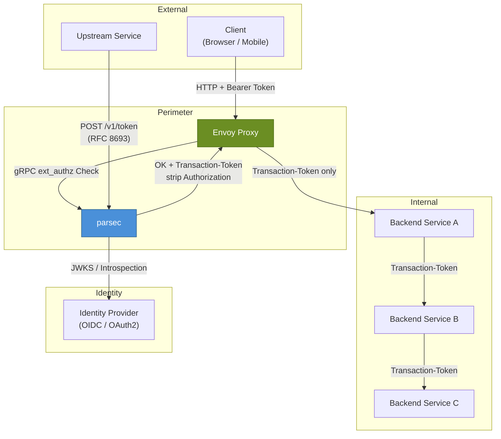
```mermaid
graph TB
    subgraph External
        Client["Client<br/>(Browser / Mobile)"]
        Service["Upstream Service"]
    end

    subgraph Perimeter
        Envoy["Envoy Proxy"]
        Parsec["parsec"]
    end

    subgraph Internal
        Backend1["Backend Service A"]
        Backend2["Backend Service B"]
        Backend3["Backend Service C"]
    end

    subgraph Identity
        IdP["Identity Provider<br/>(OIDC / OAuth2)"]
    end

    Client -- "HTTP + Bearer Token" --> Envoy
    Envoy -- "gRPC ext_authz Check" --> Parsec
    Parsec -- "JWKS / Introspection" --> IdP
    Parsec -- "OK + Transaction-Token<br/>strip Authorization" --> Envoy
    Envoy -- "Transaction-Token only" --> Backend1
    Backend1 -- "Transaction-Token" --> Backend2
    Backend2 -- "Transaction-Token" --> Backend3
    Service -- "POST /v1/token<br/>(RFC 8693)" --> Parsec

    style Parsec fill:#4A90D9,stroke:#2C5F8A,color:#fff
    style Envoy fill:#6B8E23,stroke:#4A6A16,color:#fff
```

### What parsec does

| Capability | Protocol | Spec |
|---|---|---|
| Perimeter authorization | gRPC (`envoy.service.auth.v3.Authorization`) | Envoy ext_authz |
| Token exchange | gRPC + HTTP (`POST /v1/token`) | RFC 8693 |
| Public key discovery | gRPC + HTTP (`GET /v1/jwks.json`) | RFC 7517 |
| Transaction token issuance | — | [draft-ietf-oauth-transaction-tokens](https://datatracker.ietf.org/doc/draft-ietf-oauth-transaction-tokens/) |

---

## 2. Component Architecture

### Package Dependency Graph

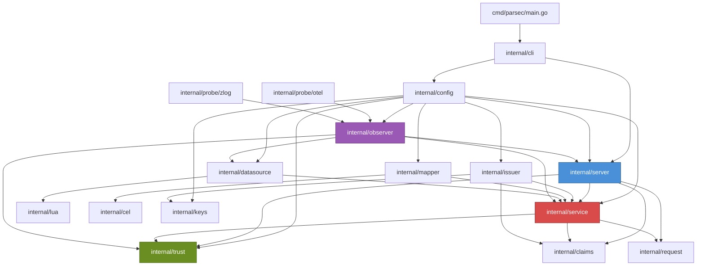
```mermaid
graph TD
    CMD["cmd/parsec/main.go"]
    CLI["internal/cli"]
    CFG["internal/config"]
    SRV["internal/server"]
    SVC["internal/service"]
    TRUST["internal/trust"]
    ISS["internal/issuer"]
    MAP["internal/mapper"]
    DS["internal/datasource"]
    LUA["internal/lua"]
    CEL["internal/cel"]
    CLM["internal/claims"]
    REQ["internal/request"]
    KEYS["internal/keys"]
    OBS["internal/observer"]
    PROBE_OTEL["internal/probe/otel"]
    PROBE_ZLOG["internal/probe/zlog"]

    CMD --> CLI
    CLI --> CFG
    CLI --> SRV
    CFG --> SRV
    CFG --> SVC
    CFG --> TRUST
    CFG --> ISS
    CFG --> MAP
    CFG --> DS
    CFG --> OBS
    CFG --> KEYS

    SRV --> SVC
    SRV --> TRUST
    SRV --> REQ
    SRV --> CLM

    SVC --> TRUST
    SVC --> REQ
    SVC --> CLM

    ISS --> SVC
    ISS --> CLM
    ISS --> KEYS

    MAP --> SVC
    MAP --> CEL

    DS --> SVC
    DS --> LUA

    OBS --> SRV
    OBS --> SVC
    OBS --> TRUST
    OBS --> DS
    PROBE_OTEL --> OBS
    PROBE_ZLOG --> OBS

    style SRV fill:#4A90D9,stroke:#2C5F8A,color:#fff
    style SVC fill:#D94A4A,stroke:#8A2C2C,color:#fff
    style TRUST fill:#6B8E23,stroke:#4A6A16,color:#fff
    style OBS fill:#9B59B6,stroke:#6C3483,color:#fff
```

### Key Interfaces

parsec is built around well-defined interfaces that enable testability and extensibility:

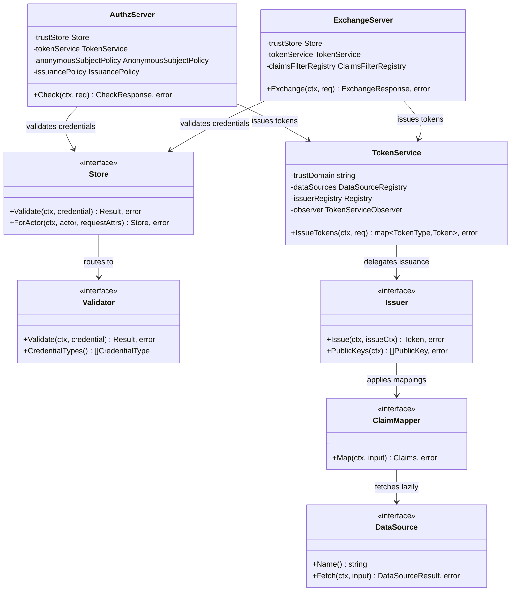
```mermaid
classDiagram
    class Store {
        <<interface>>
        +Validate(ctx, credential) Result, error
        +ForActor(ctx, actor, requestAttrs) Store, error
    }

    class Validator {
        <<interface>>
        +Validate(ctx, credential) Result, error
        +CredentialTypes() []CredentialType
    }

    class Issuer {
        <<interface>>
        +Issue(ctx, issueCtx) Token, error
        +PublicKeys(ctx) []PublicKey, error
    }

    class ClaimMapper {
        <<interface>>
        +Map(ctx, input) Claims, error
    }

    class DataSource {
        <<interface>>
        +Name() string
        +Fetch(ctx, input) DataSourceResult, error
    }

    class TokenService {
        -trustDomain string
        -dataSources DataSourceRegistry
        -issuerRegistry Registry
        -observer TokenServiceObserver
        +IssueTokens(ctx, req) map~TokenType,Token~, error
    }

    class AuthzServer {
        -trustStore Store
        -tokenService TokenService
        -anonymousSubjectPolicy AnonymousSubjectPolicy
        -issuancePolicy IssuancePolicy
        +Check(ctx, req) CheckResponse, error
    }

    class ExchangeServer {
        -trustStore Store
        -tokenService TokenService
        -claimsFilterRegistry ClaimsFilterRegistry
        +Exchange(ctx, req) ExchangeResponse, error
    }

    Store --> Validator : routes to
    AuthzServer --> Store : validates credentials
    AuthzServer --> TokenService : issues tokens
    ExchangeServer --> Store : validates credentials
    ExchangeServer --> TokenService : issues tokens
    TokenService --> Issuer : delegates issuance
    Issuer --> ClaimMapper : applies mappings
    ClaimMapper --> DataSource : fetches lazily
```

---

## 3. Bootstrap and Startup

`parsec serve` is the single operational command. The `runServe` function in `internal/cli/serve.go` orchestrates the full startup sequence.

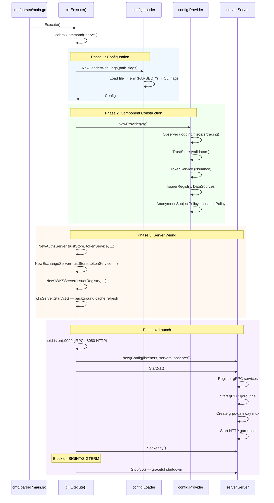
```mermaid
sequenceDiagram
    participant Main as cmd/parsec/main.go
    participant CLI as cli.Execute()
    participant Loader as config.Loader
    participant Provider as config.Provider
    participant Server as server.Server

    Main->>CLI: Execute()
    CLI->>CLI: cobra.Command("serve")

    rect rgb(240, 248, 255)
        Note over CLI,Loader: Phase 1: Configuration
        CLI->>Loader: NewLoaderWithFlags(path, flags)
        Loader->>Loader: Load file → env (PARSEC_*) → CLI flags
        Loader-->>CLI: Config
    end

    rect rgb(240, 255, 240)
        Note over CLI,Provider: Phase 2: Component Construction
        CLI->>Provider: NewProvider(cfg)
        Provider->>Provider: Observer (logging/metrics/tracing)
        Provider->>Provider: TrustStore (validators)
        Provider->>Provider: TokenService (issuance)
        Provider->>Provider: IssuerRegistry, DataSources
        Provider->>Provider: AnonymousSubjectPolicy, IssuancePolicy
    end

    rect rgb(255, 248, 240)
        Note over CLI,Server: Phase 3: Server Wiring
        CLI->>CLI: NewAuthzServer(trustStore, tokenService, ...)
        CLI->>CLI: NewExchangeServer(trustStore, tokenService, ...)
        CLI->>CLI: NewJWKSServer(issuerRegistry, ...)
        CLI->>CLI: jwksServer.Start(ctx) — background cache refresh
    end

    rect rgb(248, 240, 255)
        Note over CLI,Server: Phase 4: Launch
        CLI->>CLI: net.Listen(:9090 gRPC, :8080 HTTP)
        CLI->>Server: New(Config{listeners, servers, observer})
        CLI->>Server: Start(ctx)
        Server->>Server: Register gRPC services
        Server->>Server: Start gRPC goroutine
        Server->>Server: Create grpc-gateway mux
        Server->>Server: Start HTTP goroutine
        CLI->>Server: SetReady()
        Note over CLI: Block on SIGINT/SIGTERM
        CLI->>Server: Stop(ctx) — graceful shutdown
    end
```

### Configuration Precedence (highest wins)

```
┌────────────────────────────────┐
│  1. Command-line flags         │  --server-grpc-port 9091
├────────────────────────────────┤
│  2. Environment variables      │  PARSEC_SERVER_GRPC_PORT=9091
├────────────────────────────────┤
│  3. Configuration file (YAML)  │  server.grpc_port: 9091
├────────────────────────────────┤
│  4. Built-in defaults          │  gRPC: 9090, HTTP: 8080
└────────────────────────────────┘
```

---

## 4. Dual Protocol Stack

parsec runs two listeners sharing the same business logic. HTTP routes are auto-generated from protobuf annotations via grpc-gateway — there are no separate HTTP handler implementations.

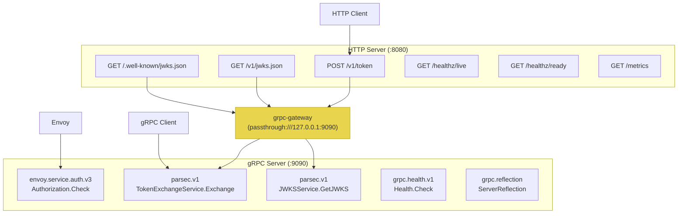
```mermaid
graph TB
    subgraph "gRPC Server (:9090)"
        ExtAuthz["envoy.service.auth.v3<br/>Authorization.Check"]
        TokenExchange["parsec.v1<br/>TokenExchangeService.Exchange"]
        JWKSService["parsec.v1<br/>JWKSService.GetJWKS"]
        Health["grpc.health.v1<br/>Health.Check"]
        Reflection["grpc.reflection<br/>ServerReflection"]
    end

    subgraph "HTTP Server (:8080)"
        PostToken["POST /v1/token"]
        GetJWKS["GET /v1/jwks.json"]
        WellKnown["GET /.well-known/jwks.json"]
        Live["GET /healthz/live"]
        Ready["GET /healthz/ready"]
        Metrics["GET /metrics"]
    end

    GW["grpc-gateway<br/>(passthrough:///127.0.0.1:9090)"]

    PostToken --> GW
    GetJWKS --> GW
    WellKnown --> GW
    GW --> TokenExchange
    GW --> JWKSService

    EnvoyClient["Envoy"] --> ExtAuthz
    HTTPClient["HTTP Client"] --> PostToken
    GRPCClient["gRPC Client"] --> TokenExchange

    style GW fill:#E8D44D,stroke:#B8A31E,color:#333
```

The grpc-gateway registers a custom `FormMarshaler` that handles `application/x-www-form-urlencoded` requests, making the token exchange endpoint fully RFC 8693 compliant.

---

## 5. Trust and Identity Model

### Dual Identity: Subject + Actor

parsec supports two identities per request, enabling "service X acting on behalf of user Y" patterns:

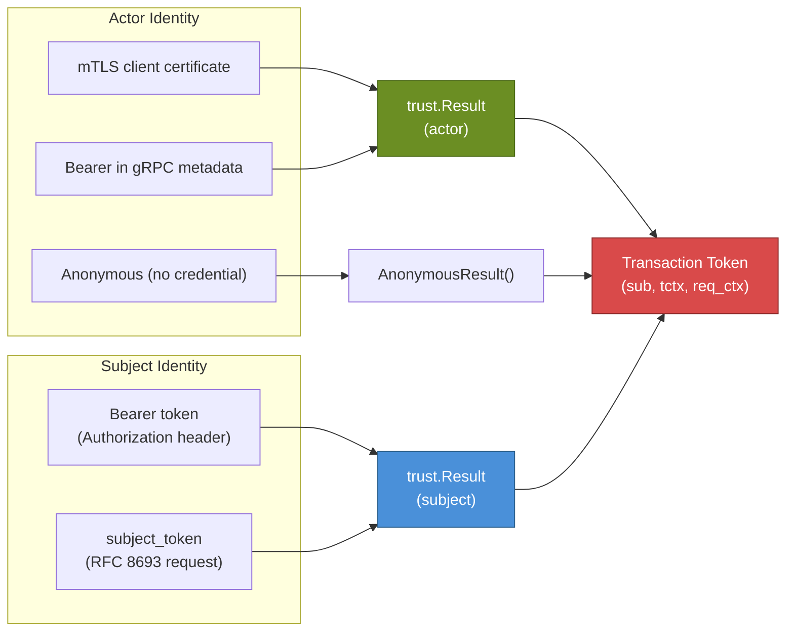
```mermaid
graph LR
    subgraph "Actor Identity"
        direction TB
        A1["mTLS client certificate"]
        A2["Bearer in gRPC metadata"]
        A3["Anonymous (no credential)"]
    end

    subgraph "Subject Identity"
        direction TB
        S1["Bearer token<br/>(Authorization header)"]
        S2["subject_token<br/>(RFC 8693 request)"]
    end

    A1 --> ActorResult["trust.Result<br/>(actor)"]
    A2 --> ActorResult
    A3 --> AnonResult["AnonymousResult()"]

    S1 --> SubjectResult["trust.Result<br/>(subject)"]
    S2 --> SubjectResult

    ActorResult --> TxnToken["Transaction Token<br/>(sub, tctx, req_ctx)"]
    AnonResult --> TxnToken
    SubjectResult --> TxnToken

    style ActorResult fill:#6B8E23,stroke:#4A6A16,color:#fff
    style SubjectResult fill:#4A90D9,stroke:#2C5F8A,color:#fff
    style TxnToken fill:#D94A4A,stroke:#8A2C2C,color:#fff
```

### Credential Type Hierarchy

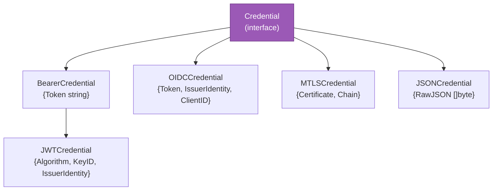
```mermaid
graph TD
    Credential["Credential<br/>(interface)"]
    Bearer["BearerCredential<br/>{Token string}"]
    JWT["JWTCredential<br/>{Algorithm, KeyID, IssuerIdentity}"]
    OIDC["OIDCCredential<br/>{Token, IssuerIdentity, ClientID}"]
    MTLS["MTLSCredential<br/>{Certificate, Chain}"]
    JSON["JSONCredential<br/>{RawJSON []byte}"]

    Credential --> Bearer
    Credential --> MTLS
    Credential --> JSON
    Credential --> OIDC
    Bearer --> JWT

    style Credential fill:#9B59B6,stroke:#6C3483,color:#fff
```

### Trust Store and Validator Filtering

The `Store` interface routes credentials to appropriate validators and supports actor-based filtering:

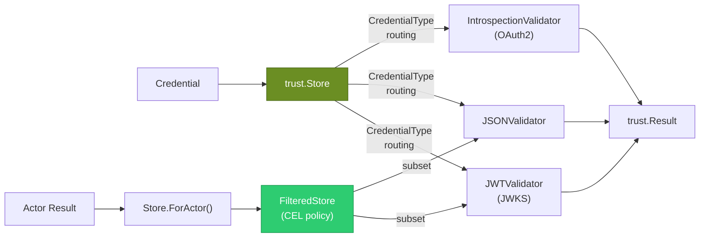
```mermaid
flowchart LR
    Cred["Credential"] --> Store["trust.Store"]
    Store --> |"CredentialType<br/>routing"| V1["JWTValidator<br/>(JWKS)"]
    Store --> |"CredentialType<br/>routing"| V2["JSONValidator"]
    Store --> |"CredentialType<br/>routing"| V3["IntrospectionValidator<br/>(OAuth2)"]

    Actor["Actor Result"] --> ForActor["Store.ForActor()"]
    ForActor --> FilteredStore["FilteredStore<br/>(CEL policy)"]
    FilteredStore --> |"subset"| V1
    FilteredStore --> |"subset"| V2

    V1 --> Result["trust.Result"]
    V2 --> Result
    V3 --> Result

    style Store fill:#6B8E23,stroke:#4A6A16,color:#fff
    style FilteredStore fill:#2ECC71,stroke:#1A9850,color:#fff
```

---

## 6. Request Flows

### A. Envoy ext_authz Flow

The primary perimeter authorization path. Envoy sends a `CheckRequest` and parsec returns an allow/deny decision with optional transaction token injection.

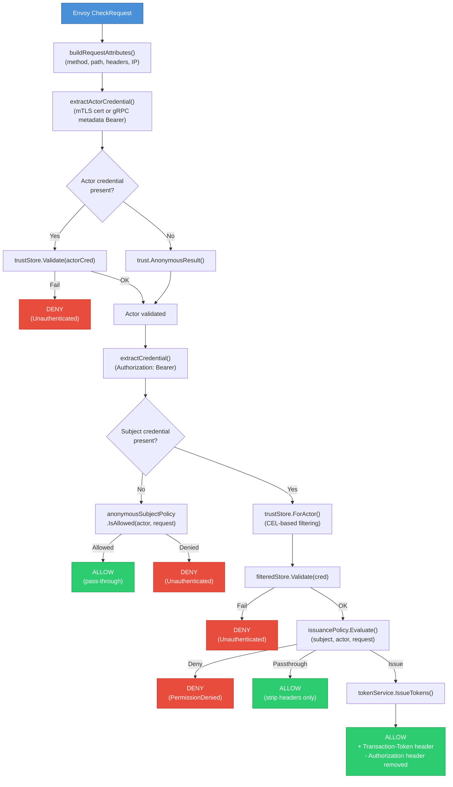
```mermaid
flowchart TD
    Start["Envoy CheckRequest"] --> BuildAttrs["buildRequestAttributes()<br/>(method, path, headers, IP)"]
    BuildAttrs --> ExtractActor["extractActorCredential()<br/>(mTLS cert or gRPC metadata Bearer)"]
    ExtractActor --> ValidateActor{"Actor credential<br/>present?"}

    ValidateActor -->|Yes| ActorValidate["trustStore.Validate(actorCred)"]
    ValidateActor -->|No| AnonActor["trust.AnonymousResult()"]

    ActorValidate -->|Fail| DenyActor["DENY<br/>(Unauthenticated)"]
    ActorValidate -->|OK| ActorOK["Actor validated"]
    AnonActor --> ActorOK

    ActorOK --> ExtractCred["extractCredential()<br/>(Authorization: Bearer)"]
    ExtractCred --> HasCred{"Subject credential<br/>present?"}

    HasCred -->|No| AnonPolicy["anonymousSubjectPolicy<br/>.IsAllowed(actor, request)"]
    AnonPolicy -->|Allowed| AllowAnon["ALLOW<br/>(pass-through)"]
    AnonPolicy -->|Denied| DenyAnon["DENY<br/>(Unauthenticated)"]

    HasCred -->|Yes| FilterStore["trustStore.ForActor()<br/>(CEL-based filtering)"]
    FilterStore --> ValidateSubject["filteredStore.Validate(cred)"]
    ValidateSubject -->|Fail| DenySubject["DENY<br/>(Unauthenticated)"]

    ValidateSubject -->|OK| IssuancePolicy["issuancePolicy.Evaluate()<br/>(subject, actor, request)"]
    IssuancePolicy -->|Deny| DenyPolicy["DENY<br/>(PermissionDenied)"]
    IssuancePolicy -->|Passthrough| AllowPassthrough["ALLOW<br/>(strip headers only)"]
    IssuancePolicy -->|Issue| IssueTokens["tokenService.IssueTokens()"]

    IssueTokens --> AllowOK["ALLOW<br/>+ Transaction-Token header<br/>- Authorization header removed"]

    style Start fill:#4A90D9,stroke:#2C5F8A,color:#fff
    style AllowOK fill:#2ECC71,stroke:#1A9850,color:#fff
    style AllowAnon fill:#2ECC71,stroke:#1A9850,color:#fff
    style AllowPassthrough fill:#2ECC71,stroke:#1A9850,color:#fff
    style DenyActor fill:#E74C3C,stroke:#C0392B,color:#fff
    style DenyAnon fill:#E74C3C,stroke:#C0392B,color:#fff
    style DenySubject fill:#E74C3C,stroke:#C0392B,color:#fff
    style DenyPolicy fill:#E74C3C,stroke:#C0392B,color:#fff
```

#### Security Boundary

The ext_authz response **removes external credential headers** (e.g. `Authorization`) and replaces them with the issued transaction token. This prevents credential leakage past the perimeter — only transaction tokens reach backend services.

### B. Token Exchange Flow (RFC 8693)

Direct token exchange for service-to-service calls, available via both gRPC and HTTP.

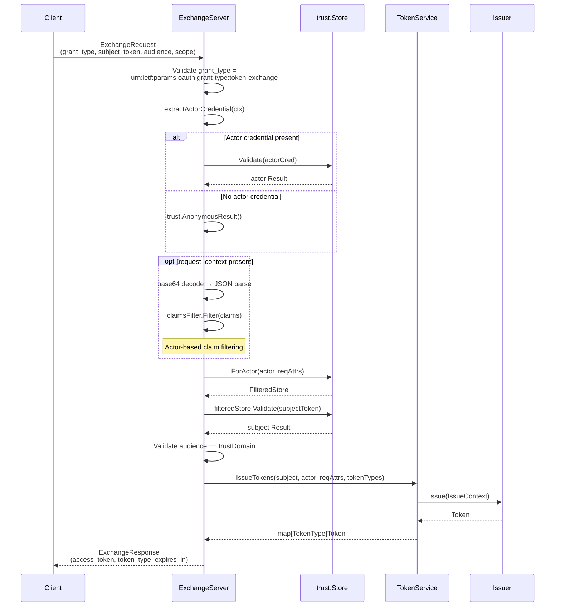
```mermaid
sequenceDiagram
    participant Client
    participant Exchange as ExchangeServer
    participant TrustStore as trust.Store
    participant TokenSvc as TokenService
    participant Issuer

    Client->>Exchange: ExchangeRequest<br/>(grant_type, subject_token, audience, scope)

    Exchange->>Exchange: Validate grant_type =<br/>urn:ietf:params:oauth:grant-type:token-exchange

    Exchange->>Exchange: extractActorCredential(ctx)
    alt Actor credential present
        Exchange->>TrustStore: Validate(actorCred)
        TrustStore-->>Exchange: actor Result
    else No actor credential
        Exchange->>Exchange: trust.AnonymousResult()
    end

    opt request_context present
        Exchange->>Exchange: base64 decode → JSON parse
        Exchange->>Exchange: claimsFilter.Filter(claims)
        Note over Exchange: Actor-based claim filtering
    end

    Exchange->>TrustStore: ForActor(actor, reqAttrs)
    TrustStore-->>Exchange: FilteredStore

    Exchange->>TrustStore: filteredStore.Validate(subjectToken)
    TrustStore-->>Exchange: subject Result

    Exchange->>Exchange: Validate audience == trustDomain

    Exchange->>TokenSvc: IssueTokens(subject, actor, reqAttrs, tokenTypes)
    TokenSvc->>Issuer: Issue(IssueContext)
    Issuer-->>TokenSvc: Token
    TokenSvc-->>Exchange: map[TokenType]Token

    Exchange-->>Client: ExchangeResponse<br/>(access_token, token_type, expires_in)
```

### C. JWKS Discovery Flow

Returns cached public keys from all configured issuers for downstream services to verify transaction tokens.

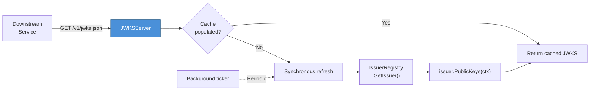
```mermaid
flowchart LR
    Client["Downstream<br/>Service"] -->|"GET /v1/jwks.json"| JWKS["JWKSServer"]
    JWKS --> Cache{"Cache<br/>populated?"}
    Cache -->|Yes| Return["Return cached JWKS"]
    Cache -->|No| Refresh["Synchronous refresh"]
    Refresh --> Issuers["IssuerRegistry<br/>.GetIssuer()"]
    Issuers --> PubKeys["issuer.PublicKeys(ctx)"]
    PubKeys --> Return

    Ticker["Background ticker"] -.->|Periodic| Refresh

    style JWKS fill:#4A90D9,stroke:#2C5F8A,color:#fff
```

---

## 7. Token Issuance Pipeline

Both ext_authz and token exchange converge on `TokenService.IssueTokens()`. The pipeline is layered:

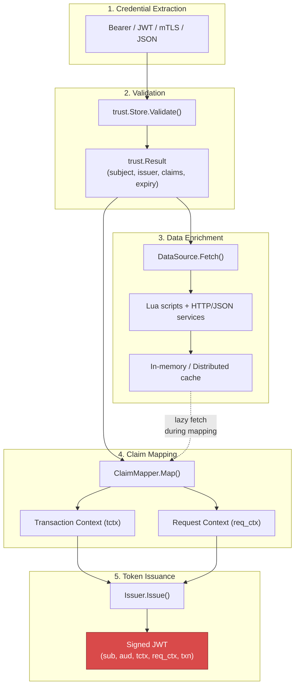
```mermaid
flowchart TD
    subgraph "1. Credential Extraction"
        CE["Bearer / JWT / mTLS / JSON"]
    end

    subgraph "2. Validation"
        V["trust.Store.Validate()"]
        VR["trust.Result<br/>(subject, issuer, claims, expiry)"]
        V --> VR
    end

    subgraph "3. Data Enrichment"
        DS["DataSource.Fetch()"]
        DSR["Lua scripts + HTTP/JSON services"]
        DSC["In-memory / Distributed cache"]
        DS --> DSR
        DSR --> DSC
    end

    subgraph "4. Claim Mapping"
        CM["ClaimMapper.Map()"]
        TCTX["Transaction Context (tctx)"]
        RCTX["Request Context (req_ctx)"]
        CM --> TCTX
        CM --> RCTX
    end

    subgraph "5. Token Issuance"
        ISS["Issuer.Issue()"]
        JWT["Signed JWT<br/>(sub, aud, tctx, req_ctx, txn)"]
        ISS --> JWT
    end

    CE --> V
    VR --> DS
    VR --> CM
    DSC -.->|"lazy fetch<br/>during mapping"| CM
    TCTX --> ISS
    RCTX --> ISS

    style JWT fill:#D94A4A,stroke:#8A2C2C,color:#fff
```

### Token Claims Structure (draft-ietf-oauth-transaction-tokens)

```json
{
  "iss": "https://parsec.example.com",
  "sub": "user@example.com",
  "aud": ["trust-domain.example.com"],
  "exp": 1719835200,
  "iat": 1719831600,
  "jti": "01912345-6789-7abc-def0-123456789abc",
  "txn": "01912345-6789-7abc-def0-123456789abc",
  "tctx": {
    "user": "user@example.com",
    "roles": ["admin", "editor"],
    "region": "us-east-1"
  },
  "req_ctx": {
    "method": "GET",
    "path": "/api/v1/resource"
  },
  "scope": "read write",
  "purp": "txn_token"
}
```

### Issuer Registry

The `Registry` maps token types to their issuers, enabling multiple token formats from a single request:

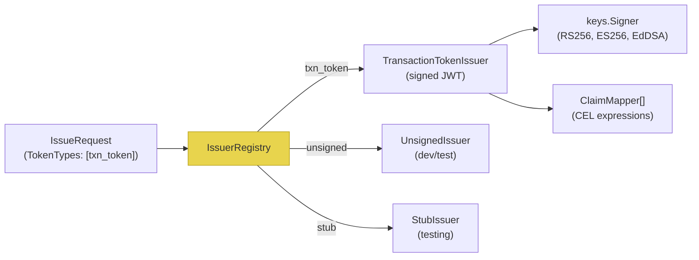
```mermaid
graph LR
    Request["IssueRequest<br/>(TokenTypes: [txn_token])"]
    Registry["IssuerRegistry"]
    TxnIssuer["TransactionTokenIssuer<br/>(signed JWT)"]
    UnsignedIssuer["UnsignedIssuer<br/>(dev/test)"]
    StubIssuer["StubIssuer<br/>(testing)"]

    Request --> Registry
    Registry -->|"txn_token"| TxnIssuer
    Registry -->|"unsigned"| UnsignedIssuer
    Registry -->|"stub"| StubIssuer

    TxnIssuer --> KeyManager["keys.Signer<br/>(RS256, ES256, EdDSA)"]
    TxnIssuer --> Mappers["ClaimMapper[]<br/>(CEL expressions)"]

    style Registry fill:#E8D44D,stroke:#B8A31E,color:#333
```

---

## 8. Policy Engine

### Anonymous Subject Policy

When no subject credentials are present (e.g. health checks, OpenAPI spec endpoints), a CEL-based policy decides whether to allow the request through:

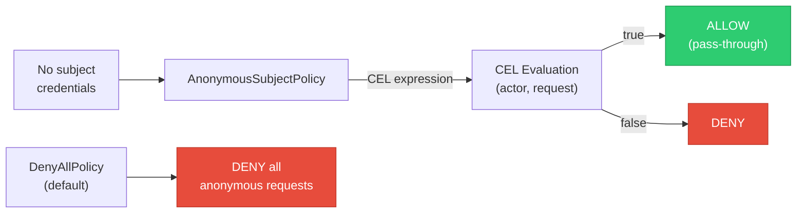
```mermaid
flowchart LR
    NoCredentials["No subject<br/>credentials"] --> Policy["AnonymousSubjectPolicy"]
    Policy -->|"CEL expression"| CEL["CEL Evaluation<br/>(actor, request)"]
    CEL -->|true| Allow["ALLOW<br/>(pass-through)"]
    CEL -->|false| Deny["DENY"]

    DenyAll["DenyAllPolicy<br/>(default)"] --> Deny2["DENY all<br/>anonymous requests"]

    style Allow fill:#2ECC71,stroke:#1A9850,color:#fff
    style Deny fill:#E74C3C,stroke:#C0392B,color:#fff
    style Deny2 fill:#E74C3C,stroke:#C0392B,color:#fff
```

Example CEL expression:
```cel
request.method == "GET" && (
  request.path == "/healthz" ||
  request.path.startsWith("/api/v1/openapi")
)
```

### Issuance Policy

Evaluated **after** subject validation but **before** token issuance. Controls whether to issue, deny, or passthrough:

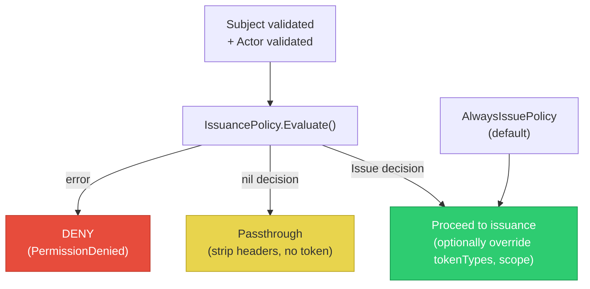
```mermaid
flowchart TD
    Validated["Subject validated<br/>+ Actor validated"] --> Policy["IssuancePolicy.Evaluate()"]
    Policy -->|"Issue decision"| Issue["Proceed to issuance<br/>(optionally override tokenTypes, scope)"]
    Policy -->|"nil decision"| Passthrough["Passthrough<br/>(strip headers, no token)"]
    Policy -->|"error"| Deny["DENY<br/>(PermissionDenied)"]
    Default["AlwaysIssuePolicy<br/>(default)"] --> Issue

    style Issue fill:#2ECC71,stroke:#1A9850,color:#fff
    style Passthrough fill:#E8D44D,stroke:#B8A31E,color:#333
    style Deny fill:#E74C3C,stroke:#C0392B,color:#fff
```

---

## 9. Data Enrichment

Data sources fetch external data (user profiles, permissions, regional info) during token issuance. They are fetched **lazily** — only when a claim mapper actually references them.

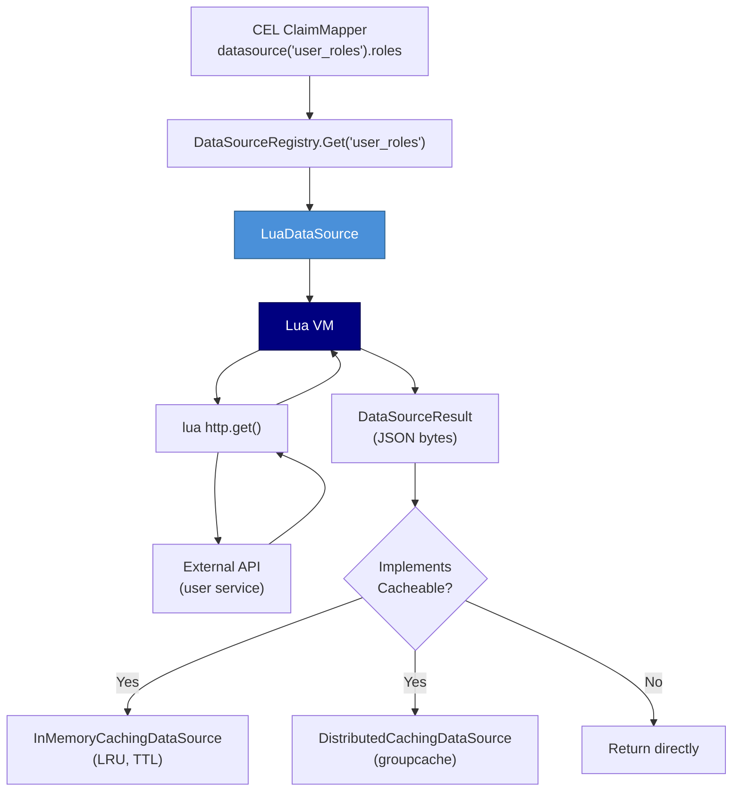
```mermaid
flowchart TD
    Mapper["CEL ClaimMapper<br/>datasource('user_roles').roles"]
    Mapper --> Registry["DataSourceRegistry.Get('user_roles')"]
    Registry --> DS["LuaDataSource"]
    DS --> LuaVM["Lua VM"]
    LuaVM --> HTTP["lua http.get()"]
    HTTP --> ExternalAPI["External API<br/>(user service)"]
    ExternalAPI --> HTTP
    HTTP --> LuaVM
    LuaVM --> Result["DataSourceResult<br/>(JSON bytes)"]
    Result --> Cache{"Implements<br/>Cacheable?"}
    Cache -->|Yes| InMemory["InMemoryCachingDataSource<br/>(LRU, TTL)"]
    Cache -->|Yes| Distributed["DistributedCachingDataSource<br/>(groupcache)"]
    Cache -->|No| Direct["Return directly"]

    style DS fill:#4A90D9,stroke:#2C5F8A,color:#fff
    style LuaVM fill:#000080,stroke:#00004D,color:#fff
```

### Caching Architecture

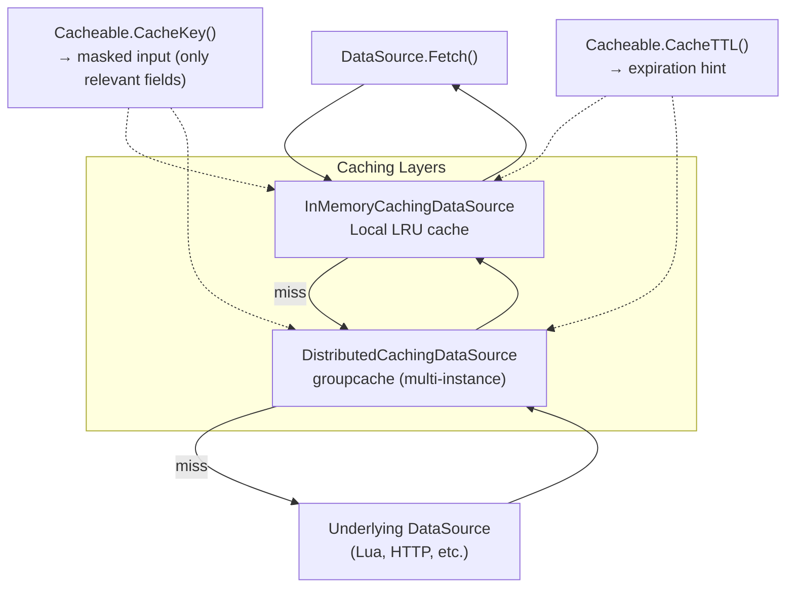
```mermaid
graph TD
    Fetch["DataSource.Fetch()"]

    subgraph "Caching Layers"
        L1["InMemoryCachingDataSource<br/>Local LRU cache"]
        L2["DistributedCachingDataSource<br/>groupcache (multi-instance)"]
    end

    Wrapped["Underlying DataSource<br/>(Lua, HTTP, etc.)"]

    Fetch --> L1
    L1 -->|"miss"| L2
    L2 -->|"miss"| Wrapped
    Wrapped --> L2
    L2 --> L1
    L1 --> Fetch

    CacheKey["Cacheable.CacheKey()<br/>→ masked input (only relevant fields)"]
    TTL["Cacheable.CacheTTL()<br/>→ expiration hint"]

    CacheKey -.-> L1
    CacheKey -.-> L2
    TTL -.-> L1
    TTL -.-> L2
```

---

## 10. Observability

parsec uses the **domain-oriented observability** pattern from [Martin Fowler](https://martinfowler.com/articles/domain-oriented-observability.html). Observer interfaces create request-scoped probes that capture execution context.

### Observer Pattern Architecture

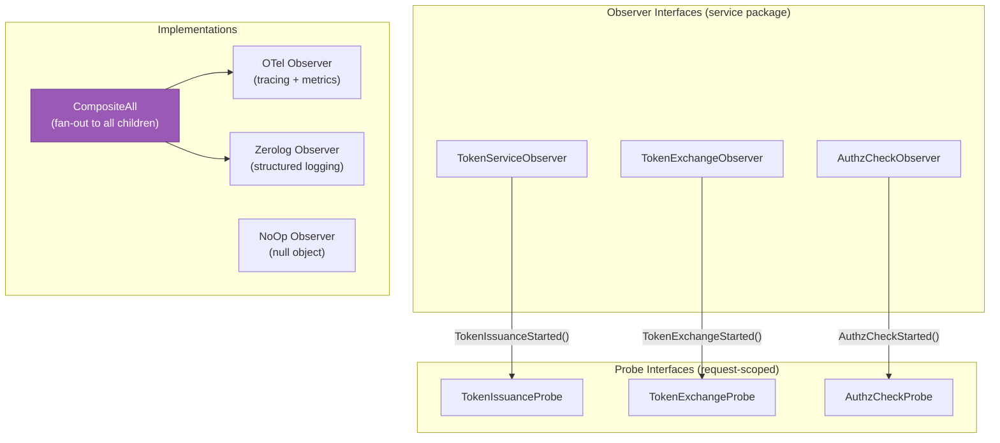
```mermaid
flowchart TD
    subgraph "Observer Interfaces (service package)"
        TSO["TokenServiceObserver"]
        TEO["TokenExchangeObserver"]
        ACO["AuthzCheckObserver"]
    end

    subgraph "Probe Interfaces (request-scoped)"
        TIP["TokenIssuanceProbe"]
        TEP["TokenExchangeProbe"]
        ACP["AuthzCheckProbe"]
    end

    subgraph "Implementations"
        Composite["CompositeAll<br/>(fan-out to all children)"]
        OTel["OTel Observer<br/>(tracing + metrics)"]
        Zlog["Zerolog Observer<br/>(structured logging)"]
        NoOp["NoOp Observer<br/>(null object)"]
    end

    TSO -->|"TokenIssuanceStarted()"| TIP
    TEO -->|"TokenExchangeStarted()"| TEP
    ACO -->|"AuthzCheckStarted()"| ACP

    Composite --> OTel
    Composite --> Zlog

    style Composite fill:#9B59B6,stroke:#6C3483,color:#fff
```

### Probe Lifecycle

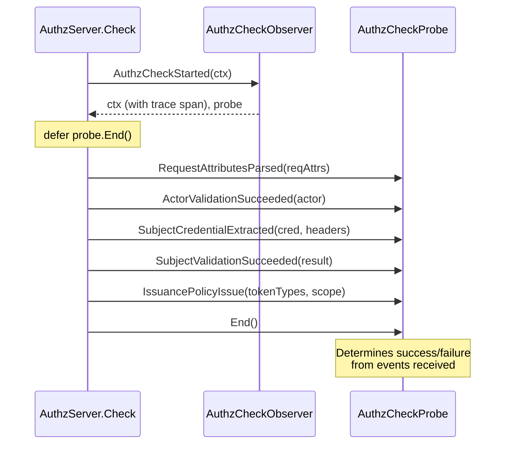
```mermaid
sequenceDiagram
    participant Handler as AuthzServer.Check
    participant Observer as AuthzCheckObserver
    participant Probe as AuthzCheckProbe

    Handler->>Observer: AuthzCheckStarted(ctx)
    Observer-->>Handler: ctx (with trace span), probe
    Note over Handler: defer probe.End()

    Handler->>Probe: RequestAttributesParsed(reqAttrs)
    Handler->>Probe: ActorValidationSucceeded(actor)
    Handler->>Probe: SubjectCredentialExtracted(cred, headers)
    Handler->>Probe: SubjectValidationSucceeded(result)
    Handler->>Probe: IssuancePolicyIssue(tokenTypes, scope)

    Handler->>Probe: End()
    Note over Probe: Determines success/failure<br/>from events received
```

The `CompositeAll` observer fans out every call to all registered children (e.g. both OpenTelemetry and structured logging), enabling multiple observability backends simultaneously.

---

## 11. Configuration System

Configuration flows through a layered loading system using [koanf](https://github.com/knadh/koanf).

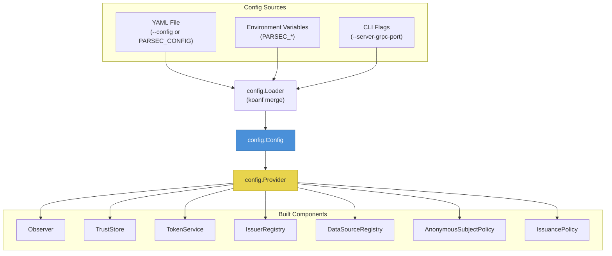
```mermaid
graph TD
    subgraph "Config Sources"
        File["YAML File<br/>(--config or PARSEC_CONFIG)"]
        Env["Environment Variables<br/>(PARSEC_*)"]
        Flags["CLI Flags<br/>(--server-grpc-port)"]
    end

    Loader["config.Loader<br/>(koanf merge)"]
    File --> Loader
    Env --> Loader
    Flags --> Loader

    Config["config.Config"]
    Loader --> Config

    Provider["config.Provider"]
    Config --> Provider

    subgraph "Built Components"
        Observer["Observer"]
        TStore["TrustStore"]
        TSvc["TokenService"]
        IReg["IssuerRegistry"]
        DSReg["DataSourceRegistry"]
        ASP["AnonymousSubjectPolicy"]
        IP["IssuancePolicy"]
    end

    Provider --> Observer
    Provider --> TStore
    Provider --> TSvc
    Provider --> IReg
    Provider --> DSReg
    Provider --> ASP
    Provider --> IP

    style Provider fill:#E8D44D,stroke:#B8A31E,color:#333
    style Config fill:#4A90D9,stroke:#2C5F8A,color:#fff
```

### Root Config Structure

```yaml
trust_domain: "example.com"

server:
  grpc_port: 9090
  http_port: 8080

authz_server:
  token_types:
    - type: "urn:ietf:params:oauth:token-type:txn_token"
      header: "Transaction-Token"
  anonymous_subject_policy:
    type: cel
    script: 'request.method == "GET" && request.path == "/healthz"'
  issuance_policy:
    type: cel
    script: '...'

trust_store:
  validators:
    - type: jwt
      issuer: "https://idp.example.com"
      jwks_url: "https://idp.example.com/.well-known/jwks.json"
      trust_domain: "example.com"

key_providers:
  - name: primary
    type: pem_file
    config: { ... }

signers:
  - name: primary
    key_provider: primary
    algorithm: RS256

issuers:
  - token_type: "urn:ietf:params:oauth:token-type:txn_token"
    type: transaction_token
    signer: primary
    claim_mappers: [...]

data_sources:
  - name: user_roles
    type: lua
    script_file: /etc/parsec/user_roles.lua

observability:
  logging: { level: info }
  metrics: { enabled: true }
  tracing: { enabled: true }
```

---

## 12. Health and Readiness

```mermaid
stateDiagram-v2
    [*] --> NOT_SERVING: Server starts

    NOT_SERVING --> SERVING: srv.SetReady()<br/>(all components initialized)
    SERVING --> NOT_SERVING: srv.SetNotReady()
    SERVING --> SHUTDOWN: SIGINT / SIGTERM
    SHUTDOWN --> [*]: healthServer.Shutdown()<br/>grpcServer.GracefulStop()<br/>httpServer.Shutdown()

    state "Per-service statuses" as Services {
        Auth: envoy.service.auth.v3.Authorization
        Exchange: parsec.v1.TokenExchangeService
        JWKS: parsec.v1.JWKSService
        Readiness: readiness (aggregate)
    }
```

| Endpoint | Protocol | Behavior |
|---|---|---|
| `grpc.health.v1.Health.Check` | gRPC | Per-service + aggregate readiness |
| `GET /healthz/live` | HTTP | Always 200 if process is running |
| `GET /healthz/ready` | HTTP | 200 only when **all** services are SERVING; 503 otherwise |

Readiness stays `NOT_SERVING` until `srv.SetReady()` is called after all components are fully initialized. On shutdown, `healthServer.Shutdown()` sets all services to `NOT_SERVING` and rejects future status updates.

---

## Project Structure

```
parsec/
├── cmd/parsec/
│   └── main.go                          # Process entry point → cli.Execute()
├── api/
│   ├── proto/parsec/v1/                 # Proto definitions
│   │   ├── token_exchange.proto         # Token exchange + HTTP annotations
│   │   └── jwks.proto                   # JWKS + HTTP annotations
│   └── gen/                             # Generated gRPC/gateway code
├── internal/
│   ├── cli/
│   │   ├── root.go                      # Cobra root command
│   │   └── serve.go                     # Bootstrap and startup orchestration
│   ├── config/
│   │   ├── config.go                    # Root Config struct (koanf tags)
│   │   ├── loader.go                    # File + env + flag merging
│   │   └── provider.go                  # Config → component construction
│   ├── server/
│   │   ├── server.go                    # Dual gRPC + HTTP server lifecycle
│   │   ├── authz.go                     # ext_authz Authorization.Check
│   │   ├── exchange.go                  # RFC 8693 token exchange
│   │   ├── jwks.go                      # JWKS discovery with caching
│   │   ├── actor_credential.go          # Actor identity extraction
│   │   ├── anonymous_subject_policy.go  # CEL policy for unauthenticated requests
│   │   ├── issuance_policy.go           # CEL policy for issue/deny/passthrough
│   │   └── form_marshaler.go            # RFC 8693 form encoding
│   ├── service/
│   │   ├── service.go                   # TokenService orchestration
│   │   ├── issuer.go                    # Issuer interface + IssueContext
│   │   ├── datasource.go               # DataSource interface + registry
│   │   ├── mapper.go                    # ClaimMapper interface
│   │   ├── observer.go                  # Observer/Probe interfaces
│   │   └── types.go                     # TokenType definitions
│   ├── trust/
│   │   ├── validator.go                 # Validator interface + credential types
│   │   ├── store.go                     # Store interface
│   │   ├── jwt_validator.go             # JWT/JWKS validation
│   │   ├── json_validator.go            # JSON credential validation
│   │   ├── filtered_store.go            # Actor-based store filtering
│   │   └── cel_validator_filter.go      # CEL-based filtering
│   ├── issuer/                          # Issuer implementations (txn_token, unsigned)
│   ├── mapper/                          # ClaimMapper implementations (CEL)
│   ├── datasource/                      # DataSource implementations (Lua + caching)
│   ├── lua/                             # Lua runtime services (HTTP, JSON, config)
│   ├── cel/                             # CEL library extensions
│   ├── claims/                          # Claims type and filtering
│   ├── keys/                            # Key management and signing
│   ├── request/                         # RequestAttributes type
│   ├── observer/                        # CompositeAll observer
│   └── probe/
│       ├── otel/                        # OpenTelemetry (tracing + metrics)
│       └── zlog/                        # Zerolog structured logging
├── configs/                             # Example configuration files
└── docs/                                # Documentation and diagrams
```
